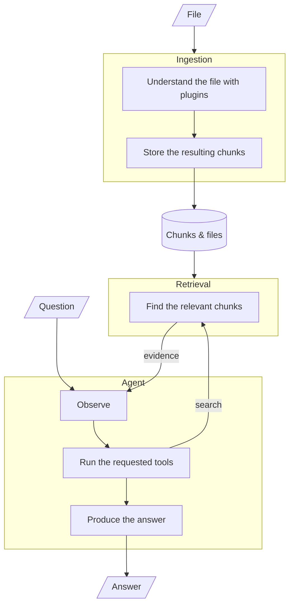
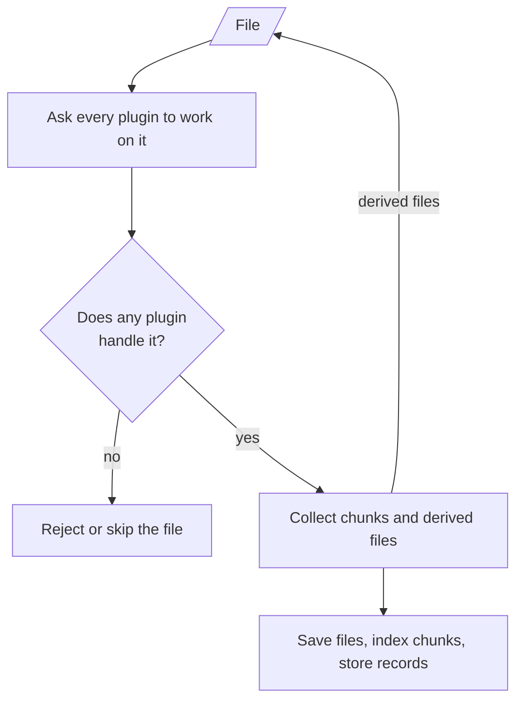
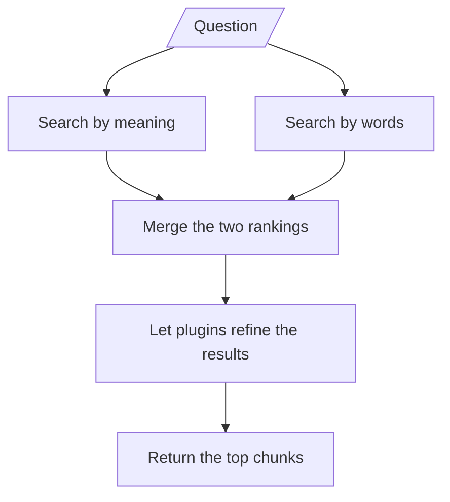
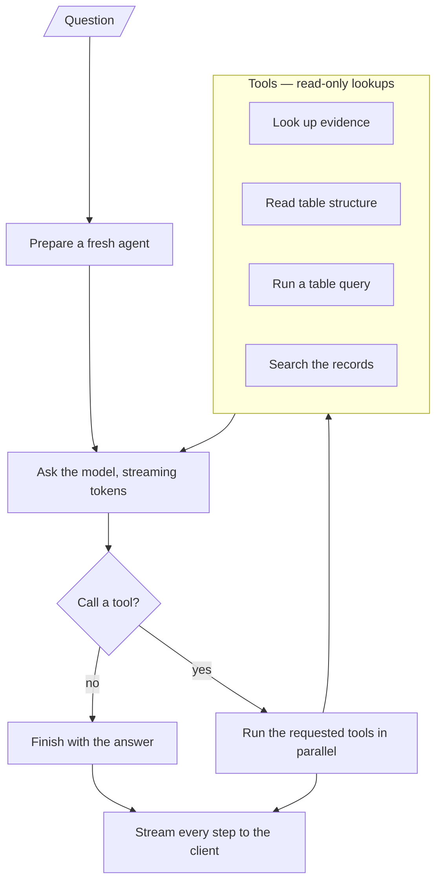
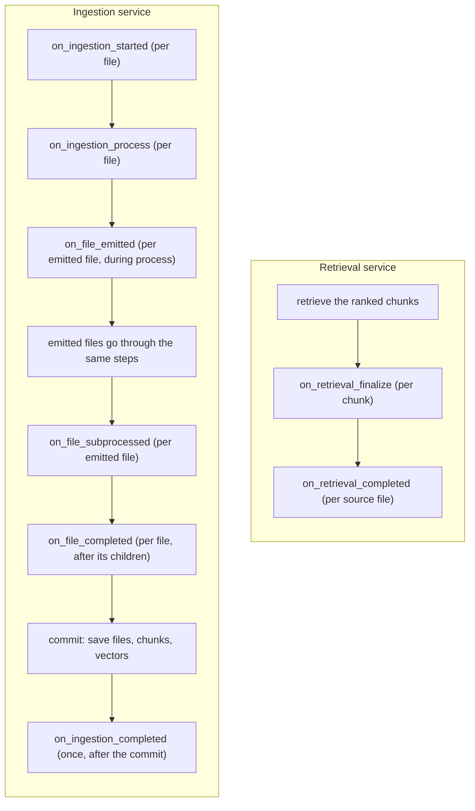

# Agentic RAG

An agentic Retrieval-Augmented Generation (RAG) pipeline built around a **plugin architecture** for document types. It ingests text documents and spreadsheets, creates searchable representations, retrieves relevant evidence using both semantic and lexical search, and uses an LLM to generate grounded answers.

The application is designed around separate ingestion, retrieval, and answer-generation stages. Document-type behavior lives in **plugins**, which the system discovers and orchestrates through a plugin registry and per-run contexts and runtimes.

## Table of Contents

- [Agentic RAG](#agentic-rag)
  - [Table of Contents](#table-of-contents)
  - [Features](#features)
  - [Running the Application](#running-the-application)
    - [Requirements](#requirements)
    - [Environment Configuration](#environment-configuration)
    - [Start the Application](#start-the-application)
    - [Talking to it](#talking-to-it)
  - [Architecture](#architecture)
    - [Ingestion Pipeline](#ingestion-pipeline)
    - [Retrieval Pipeline](#retrieval-pipeline)
    - [Answer Generation](#answer-generation)
  - [Plugin Lifecycle](#plugin-lifecycle)
  - [Context and Runtime](#context-and-runtime)
  - [File Emission and Subprocess](#file-emission-and-subprocess)
    - [File descriptions](#file-descriptions)
    - [Text Plugin: Reassembling tables split across pages](#text-plugin-reassembling-tables-split-across-pages)
  - [Project Structure](#project-structure)
    - [`app/agent`](#appagent)
    - [`app/agent_tools`](#appagent_tools)
    - [`app/plugin`](#appplugin)
    - [`app/plugins`](#appplugins)
    - [`app/api`](#appapi)
    - [`app/api_schemas`](#appapi_schemas)
    - [`app/core`](#appcore)
    - [`app/errors`](#apperrors)
    - [`app/llm`](#appllm)
    - [`app/embedders`](#appembedders)
    - [`app/retrievers`](#appretrievers)
    - [`app/models`](#appmodels)
    - [`app/services`](#appservices)
    - [`app/store_file`, `app/store_sql`, `app/store_vector`](#appstore_file-appstore_sql-appstore_vector)
    - [`app/utils`](#apputils)
    - [`app/container.py`](#appcontainerpy)
  - [Design Principles](#design-principles)
  - [Tests](#tests)
  - [Extending the Application](#extending-the-application)
    - [Adding Another Plugin](#adding-another-plugin)
    - [Adding Another LLM Provider](#adding-another-llm-provider)
    - [Adding Another Embedding Provider](#adding-another-embedding-provider)
    - [Adding Another Retrieval Strategy](#adding-another-retrieval-strategy)
    - [Changing Storage Technology](#changing-storage-technology)

## Features

- **Plugin architecture.** Each document type is a plugin that decides which files it handles and how to turn them into searchable chunks. The built-in plugins are `TextPlugin` (text documents such as pdf, docx, txt, md, and html; it also detects embedded tables and images and hands them off for processing) and `TablePlugin` (spreadsheets: csv, xlsx, xls).
- **Hybrid retrieval.** Each question runs a semantic vector search and a lexical full-text search in parallel, and the two rankings are fused with Reciprocal Rank Fusion. Reworded questions and exact terms both find the right chunks.
- **Agentic answers.** Answers come from a tool-using agent (langgraph) that searches the corpus for evidence, inspects table schemas, and runs targeted SQL. It streams its tool steps and the answer token by token, and it supports multi-turn conversation.
- **Schema-first tables.** Each table's structure (column names and types) and shape are computed once at ingestion and stored on its chunk. The agent inspects that schema and writes SQL instead of reading table data, so inspecting a million-row table costs the same as a ten-row one.

## Running the Application

### Requirements

- Python 3.11+ (or Docker)
- An OpenAI API key for the LLM and a Google API key for the embedder
- Optionally, an Unstructured API key, if you partition documents through the hosted Unstructured API
- For local partitioning, Unstructured's system dependencies (poppler-utils, tesseract-ocr, libreoffice, libmagic1). The Docker image already includes them.

### Environment Configuration

Create a `.env` file in the root directory:

```env
OPENAI_API_KEY=your-openai-key
GOOGLE_API_KEY=your-google-key
UNSTRUCTURED_API_KEY=your-unstructured-key
```

`app/core/config.py` is the source of truth for all settings.

### Start the Application

With Python:

```bash
python -m venv venv
source venv/bin/activate
pip install -r requirements.txt
python -m run
```

The server listens on port 8000 with reload enabled for development, and the interactive API docs are at `http://localhost:8000/docs`.

With Docker:

```bash
docker compose up --build
```

`compose.yaml` builds the image (including Unstructured's system dependencies), exposes port 8000, and reads your `.env`. One note on data location: the storage settings default to `./.storage`, which inside the container is not the mounted `./storage` volume. To persist data on the host, set `FILE_LOCAL_STORAGE_DIR`, `SQL_LOCAL_STORAGE_DIR`, and `VECTOR_LOCAL_STORAGE_DIR` in `.env` to `/app/storage/file`, `/app/storage/sql`, and `/app/storage/vector`.

### Talking to it

- **Ingest a document:**

  ```bash
  curl -X POST localhost:8000/rag/ingest -F "file=@example_docs/your.pdf"
  ```

- **Ask a question and watch the agent work:**

  ```bash
  python stream_agent.py "your question"
  ```

  The script prints each tool call and result as it happens, types out the answer token by token, and lists the evidence chunks at the end. Run it bare (with no argument) for an interactive conversation; the memory stays in the process for the session, so follow-up questions work. Set `RAG_BASE_URL` to point it at another server.

- **JSON endpoints:** `POST /rag/ingest` (multipart upload), `POST /rag/retrieve?user_query=...`, `POST /rag/answer` (JSON body `{"query", "history"}`), and `POST /rag/answer/stream` (same body, returned as a server-sent event stream).

## Architecture

The system is divided into three pipelines:

1. **Ingestion** turns uploaded files into searchable chunks.
2. **Retrieval** finds the chunks relevant to a question.
3. **The agent** answers questions by working through tools over the stored data.

They meet at the stored chunks: ingestion writes them, retrieval reads them, and the agent reads them through its tools.



### Ingestion Pipeline



You upload a file, and the pipeline does the following:

1. Every registered plugin is asked whether it handles the file. If none does, ingestion fails for an uploaded file (an emitted file is skipped with a warning).
2. The plugins that handle it run concurrently. Each one parses the file and returns searchable chunks, and each can hand off derived files (for example, a table found inside a pdf) back into the pipeline.
3. Every derived file goes through the same steps recursively, so a file's whole subtree is processed before the pipeline moves on.
4. Nothing is saved while the tree is walked. Once every file in the tree has processed successfully, the pipeline commits everything in one step: it stores the files, embeds and stores the chunks, and writes the chunk records. If any file fails, nothing is saved.

A document's content ends up in three stores: the original and derived files in the file store, one vector per chunk in the vector store, and one record per chunk (text and metadata) in the SQL store, which also powers the lexical search.

### Retrieval Pipeline



Retrieval runs two searches in parallel and merges their rankings:

- **Semantic search** embeds the question with the same embedder used for the chunks and finds the nearest vectors. The vector store keeps only ids and embeddings, so the matching chunk records are then loaded from SQL in the vector's ranking order.
- **Lexical search** runs full-text search (FTS5) over the chunk text in SQL.

The two rankings are combined with Reciprocal Rank Fusion (RRF). RRF merges ranks instead of scores, so the two searches contribute to one list even though they measure relevance differently. The top chunks then pass through a plugin finalization step (see Plugin Lifecycle) before they are returned.

### Answer Generation



Answering runs an agent built on langgraph. The agent loops between two steps: it asks the LLM (with the tools available), and when the LLM requests tools, it runs them and feeds the results back. Once the loop reached the max limits, the LLM is called without tools and must answer, so the loop always terminates.

The agent's tools are read-only lookups over the RAG system:

- `search_documents`: hybrid retrieval over the corpus, through the same path the `/rag/retrieve` endpoint uses.
- `list_tables`: the stored tables' names, ids, and row/column counts.
- `inspect_table`: a table's schema (columns and types) and shape, read from stored metadata with no file read.
- `query_table`: runs the model's SQL over one table in a throwaway in-memory database and returns at most 100 rows. The only tool that reads table data.
- `query_chunks`: read-only SELECT over the chunk and document records.

The system prompt's tools section is generated from the tool definitions (`AgentTools.outline()`), so the prompt can never list a tool the agent does not have or miss one it does. The agent answers only from tool output, cites claims with `[source-id:chunk-id]`, and the answer's reported evidence is exactly the chunks its searches returned.

**Streaming.** The LLM providers stream natively, and the run is forwarded as events: a token event per streamed token, a tool-call event per tool the model requests, a tool-result event per result, and a final answer event. `POST /rag/answer/stream` serves these as server-sent events (`answer_delta` frames as the answer types out, `tool_call` / `tool_result` frames while the agent works, then a final `answer` frame with the full answer JSON).

**Conversation.** Both answer endpoints take a JSON body `{"query": ..., "history": [...]}`. The prior turns (oldest first) are placed between the system prompt and the current question, so follow-ups resolve against the earlier conversation. The server stays stateless; the memory belongs to the caller.

The layers, so each concern has one home:

- `app/agent/`: the generic agent framework (the loop, the events, the tool abstractions). No RAG knowledge.
- `app/agent_tools/`: the RAG tools, one module each.
- `app/services/agent_service.py`: composes the generic agent with the RAG tools and retrieval path into the answering pipeline.
- `app/api/agent.py`: the answer endpoints.

## Plugin Lifecycle

The pipeline is driven by a fixed set of lifecycle events. Each event is a method on the `Plugin` base class with a no-op default; plugins override only what they care about. The registry fires every event to **all** registered plugins (concurrently, in registration order), and each plugin decides for itself whether to act (typically by guarding with `accepts`, or by recognizing its own chunks via `chunk.plugin`). Every event receives the per-run context and the runtime of its phase: ingestion events carry `IngestionRuntime`, retrieval events carry `RetrievalRuntime`.

Where each hook is triggered in the two services:



Two events are **response events** (the service consumes what the plugins return):

- `on_ingestion_process`: plugins return the `IngestedChunk`s they generated (or `[]`); the service flattens them in registration order.
- `on_retrieval_finalize`: plugins return a replacement `RetrievedChunk` for chunks they produced, or `None` to leave the chunk unchanged; the service applies the last non-None replacement.

All other events are observational. Event-specific arguments come first; `context` and `runtime` are always the last two.

| Event                 | Plugin method            | Arguments                                      | Returns                  |
| --------------------- | ------------------------ | ---------------------------------------------- | ------------------------ |
| `ingestion_started`   | `on_ingestion_started`   | `context`, `runtime`                           | -                        |
| `ingestion_process`   | `on_ingestion_process`   | `context`, `runtime`                           | `list[IngestedChunk]`    |
| `file_emitted`        | `on_file_emitted`        | `emitted_file`, `context`, `runtime`           | -                        |
| `file_subprocessed`   | `on_file_subprocessed`   | `emitted_file`, `chunks`, `context`, `runtime` | -                        |
| `file_completed`      | `on_file_completed`      | `chunks`, `context`, `runtime`                 | -                        |
| `ingestion_completed` | `on_ingestion_completed` | `chunks`, `context`, `runtime`                 | -                        |
| `retrieval_finalize`  | `on_retrieval_finalize`  | `chunk`, `context`, `runtime`                  | `RetrievedChunk \| None` |
| `retrieval_completed` | `on_retrieval_completed` | `chunks`, `context`, `runtime`                 | -                        |

`file_completed` fires once per file in the emission tree (the file's `context`, the chunks of its whole subtree, and that file's `runtime`) after the file and all its emitted children are processed, before anything is committed. `ingestion_completed` fires once per ingestion, at the very end, after the commit.

Example: a plugin that generates chunks and audits ingestion:

```python
class AuditPlugin(Plugin):
    @property
    def name(self) -> str:
        return "audit"

    def accepts(self, context) -> bool:
        return context.file.filename.lower().endswith(".png")

    async def on_ingestion_process(self, context, runtime) -> list[IngestedChunk]:
        return [make_chunk(context)]

    async def on_ingestion_completed(self, chunks, context, runtime) -> None:
        print(f"[audit] {context.file.filename} -> {len(chunks)} chunks")
```

A new lifecycle point is added as a method on the `Plugin` base class (no-op default) and fired from the registry; there is no open event namespace.

## Context and Runtime

Plugin constructors take **options only, no services**. Lifecycle methods receive:

- **`IngestionContext`**: what is being ingested. `file` (an `IngestionFile`: the bytes, identity, auto-generated `source_id`, and optional `description`), `parent_file` (the file that emitted the current `file`, none if `file` is root), and `origin_file` (the original uploaded file).
- **`RetrievalContext`**: what is being retrieved: `user_query`. It is the retrieval-phase counterpart of `IngestionContext` and is passed to every retrieval lifecycle method.
- **`IngestionRuntime`**: the per-run state and shared services a plugin gets:

| Member                                                            | Purpose                                                                    |
| ----------------------------------------------------------------- | -------------------------------------------------------------------------- |
| `context`                                                         | The ingestion context for this run.                                        |
| `llm`                                                             | The LLM provider being used in the pipeline.                               |
| `embedder`                                                        | The embedding provider.                                                    |
| `vector_storage` / `sql_storage` / `file_storage`                 | The shared storages, for plugins that need to read or write other content. |
| `registry`                                                        | The plugin registry; `emit_file` reports emitted files through it.         |
| `emit_file(filename, content_type, file_bytes, description=None)` | Emit a file for subprocess by the plugins that accept it.                  |

Chunk and source persistence is not a runtime action. The ingestion service persists everything the plugins return: it embeds and stores chunk records, stores every file exactly once in `documents/`, and stores lineage as dedicated columns: `source_id` (the file the chunk came from), `parent_source_id` (the emitting file's `source_id`, `None` for top-level files), and `origin_source_id` (always set: the top-most file in the emission chain, so any chunk can be referenced back to the original document it descended from, not just its direct parent; a top-level file is its own origin). `IngestionContext` exposes the matching `file`, `parent_file`, and `origin_file`.

On the retrieval side, the `RetrievalService` builds a per-run **`RetrievalContext`** (holding `user_query`) and a **`RetrievalRuntime`** exposing `context` and `llm`. Both are passed to every retrieval lifecycle method.

## File Emission and Subprocess

Plugins can emit files so embedded content is processed as its own document:

1. A plugin calls `runtime.emit_file(filename, content_type, file_bytes, description=None)` while handling `on_ingestion_process`. This builds a new `IngestionFile` (with its own auto-generated `source_id`).
2. After the hook completes, the `IngestionService` takes all emitted files and runs each one back through `ingest`, passing the emitting file as the `parent_file`: full pipeline, distinct source. Each emitted file is also stored in `documents/` (with `is_origin = False`), so embedded content like extracted tables and images is persisted alongside the original upload.
3. The emitted file is offered to all plugins again, and the one(s) that accept it process it.

### File descriptions

Context about a file travels on the file itself:

- `IngestionFile` carries an optional `description` and its own auto-generated, read-only `source_id`. Every file ingested (top-level or emitted) is a distinct source identified by `source_id`; lineage between an emitted file and the file that produced it is carried by `IngestionContext.parent_file`.
- Plugins can read the description via `context.file.description` for additional context. Chunks store their lineage as columns: `source_id` (the file they came from), `parent_source_id` (the emitting file's `source_id`, `None` for top-level files), and `origin_source_id` (always set: the top-most file in the emission chain, so any chunk can be referenced back to the original document it descended from, not just its direct parent; a top-level file is its own origin). `IngestionContext` exposes the matching `file`, `parent_file`, and `origin_file`.

This is how a plugin enriches content it hands off: the built-in `TextPlugin` emits each reassembled embedded table as a CSV whose description combines the parent file's `description` (if any) with the document text found around the table. `TablePlugin` then passes that context to its LLM. The same mechanism is used for images: `TextPlugin` emits each extracted image with a description (caption and nearby text), ready for an image plugin to consume.

The main use today is a text document with embedded tables: `TextPlugin` reassembles each parsed table and emits it as a CSV, and `TablePlugin` generates the searchable chunk for it. Embedded images are emitted with `runtime.emit_file`; until an image plugin accepts them the service logs that they were not accepted, but the figure's description is still indexed as a text chunk so the content stays searchable.

### Text Plugin: Reassembling tables split across pages

A table that spans a page break is parsed by Unstructured into separate table elements, one per page. `TextPlugin` walks the element stream in order and groups **runs** of tables: a run is a maximal sequence of table elements with only page furniture (page breaks, page numbers, headers, footers) between them. Any other element (text, an image, an unparseable table) ends the run, because that content genuinely separates the tables in the document. A bare page break does not.

Each run is handed to `merge_table_fragments` (in `app/plugins/text.py`, since the logic is specific to that plugin's parsing), which folds the fragments back into whole tables:

- a fragment whose header repeats the table's header is a continuation page: its header is dropped (kept once) and its rows appended;
- a fragment with **no** header is appended as raw data rows when its column count matches and its values are type-compatible with the table's existing rows (a column does not mix numbers with non-numeric text); this recovers continuations where the header was not repeated;
- anything else (different column count, different header, conflicting value types) starts a new table.

Each reassembled table is emitted as a CSV with a header row (generated `col_N` names when none was detected, so downstream readers treat row 0 as column names) and a description containing, up to `NEARBY_TEXT_CHARS` (default 500) characters of the document text found immediately before and after the table.

## Project Structure

### `app/agent`

A **generic** tool-calling agent framework (langgraph). It knows nothing about RAG: it is handed an LLM, a set of tools, and an optional system prompt, and the only framework types it uses are langgraph's state graph and langchain-core messages (confined to `graph.py` and `agent.py`).

- `app/agent/tools.py` - `AgentTool` (name, description, JSON-schema parameters, an async `execute` that returns the text the model reads) and `AgentTools` (the named set the graph and the LLM specs derive from; tool failures become error strings). `AgentTools.outline()` renders the set as a system-prompt outline (each tool's description plus a compact parameter summary), so prompts can be built from the tool definitions.
- `app/agent/graph.py` - the orchestration graph: a model node (asks the LLM with the tools) and a tools node (executes the requested calls, concurrently when a round has several), with a tool budget that forces a final answer.
- `app/agent/events.py` - the run's observable trace as frozen dataclasses: `AnswerDeltaEvent` (a streamed token), `ToolCallEvent`, `ToolResultEvent`, and `AnswerEvent` (canonical, the last event of a run).
- `app/agent/agent.py` - `Agent`: the LLM + tools + compiled graph; `ask_stream(question)` runs the graph and yields its events (tokens as they stream, then each step), and `ask(question)` is the final-answer projection of it.

The RAG-specific tools, system prompt, and per-answer composition live in `app/agent_tools/` and `app/services/agent_service.py`, so this package stays reusable and RAG-free.

### `app/agent_tools`

The RAG agent's tools, one module each: `search_documents.py`, `list_tables.py`, `inspect_table.py`, `query_table.py`, `query_chunks.py`, plus `common.py` (the shared table-resolution and schema helpers). `build_rag_tools(retrieve=, sql_storage=, file_storage=)` assembles the built-in set. They are read-only and token-lean: `inspect_table` reads the schema/shape from chunk metadata (no file read; the description lives in the chunk text), and `query_table` reads only the target sheet and caps output at 100 rows.

### `app/plugin`

The plugin framework: the `Plugin` base class with its overridable lifecycle methods, `IngestionFile` / `IngestionContext`, `IngestionRuntime` / `RetrievalRuntime`, and the `PluginRegistry` that fires events to all plugins. `IngestionFile` is the unit of ingestion (a file's bytes, an auto-generated `source_id`, and an optional `description`), used both at the API boundary (built by the RAG service from the upload) and for files a plugin emits for subprocess. `IngestionContext` is `file` + `origin_file` + `parent_file`.

### `app/plugins`

Built-in document-type plugins. Each module contains one `Plugin` subclass.

#### `app/plugins/text.py`

`TextPlugin` handles text documents (pdf, docx, txt, md, html, and more). It parses the source with Unstructured.io (locally, or through the hosted API when `use_api=True`), chunks the text (`chunk_by_title` when titles are present, otherwise `chunk_elements`), and manages the embedded content:

- **Embedded tables** are reassembled across page breaks (see [Text Plugin: Reassembling tables split across pages](#text-plugin-reassembling-tables-split-across-pages)) and emitted as CSVs for the `TablePlugin` to process.
- **Embedded images** are emitted with a description (caption and nearby text) for a future image plugin, and each figure's description is indexed as its own text chunk so the content stays searchable.

Constructor options: `ignore_images` and `ignore_tables` (both default `False`) skip the processing of embedded images or tables (an ignored image still separates table runs in the document stream), and `use_api` / `api_key` switch partitioning to the hosted Unstructured API.

#### `app/plugins/table.py`

`TablePlugin` handles spreadsheets (csv, xlsx, xls) and the table CSVs emitted by `TextPlugin`. It reads the file with pandas (one table per sheet), keeping table and column names exactly as they came from the file (no normalization, deduplication, or renaming).

It asks the LLM for one workbook-level pass that produces retrieval-optimized descriptions: the workbook meaning and a description for each table. The result is one chunk per table:

- **searchable text**: the table name, workbook context, the table's description, and a small sample of its rows.
- **metadata**: `table_name`, the precomputed `schema` (column names and inferred types), `row_count`, and `column_count`. For tables embedded in a parent document, the metadata also carries the `source_page_number` inherited from the parent's chunks. The description is not duplicated into the metadata; it is already in the text.

Storing the schema is what lets the agent inspect and query a table without reading its file. The table data itself stays a file (the uploaded spreadsheet, or the emitted CSV for embedded tables), linked from the chunk record; the agent reads it through `query_table`. The plugin does not emit or store any file of its own, and table rows are not loaded into SQL at ingestion.

### `app/api`

Contains the FastAPI HTTP routes, split by service: the RAG routes (ingest/retrieve) in `rag.py`, the agent routes (answer) in `agent.py`.

#### `app/api/rag.py`

Contains the RAG endpoints, backed by the `RagService`:

- `/rag/ingest`: uploads and ingests a document. The endpoint is the only place that touches FastAPI's `UploadFile`; it reads the upload and hands the plain bytes, filename, and content type to the RAG service, which builds the `IngestionFile`.
- `/rag/retrieve`: retrieves relevant chunks without generating a final answer.

#### `app/api/agent.py`

Contains the answer endpoints, backed by the `AgentService`:

- `/rag/answer`: JSON body `{"query", "history"}`; generates the final LLM answer for the question plus its prior conversation.
- `/rag/answer/stream`: the same body; the agent run as a server-sent event stream (an `answer_delta` frame per streamed token, a `tool_call` frame per tool it requests, a `tool_result` frame per result it reads, and one final `answer` frame carrying the JSON `RagAnswer`).

### `app/api_schemas`

Contains Pydantic models used specifically at the API boundary. These are separate from the application's internal dataclasses so internal objects can contain fields that should not be exposed through JSON responses.

### `app/core`

Application-wide configuration and core infrastructure.

- `app/core/config.py` - settings (API keys, model names, storage paths, collection names).
- `app/core/exceptions.py` - exception handlers registered on the FastAPI app.

### `app/errors`

Domain-specific errors (`InvalidDocumentError` for unsupported/invalid uploads).

### `app/llm`

- `app/llm/base.py` - the `LLMProvider` interface: the wire types (`ChatMessage`, `ImageContent`, `ToolSpec`, `ToolCall`, `RawDelta`, `ChatResult`) and the public surface. A `ChatMessage`'s content is a plain string or a list of text and image parts (vision). Providers implement one raw primitive (`stream_complete`, a token-level stream of `RawDelta`s (text pieces and whole tool calls) that accepts any combination of tools and a JSON schema) and declare `capabilities` (both providers assume full native support: tool calling, structured outputs, and vision). The base class provides `complete` (the stream accumulated into one `RawResult`) and `answer` (plain text), `chat` (native tool calling), and `structured` (native JSON-schema output, validated with pydantic) as thin compositions of it. There are no fallback strategies: if the model or endpoint cannot comply, the error propagates.
- `app/llm/openai.py` - the OpenAI-compatible implementation (custom `base_url` supported, for example a routing endpoint).
- `app/llm/gemini.py` - the Gemini implementation.

### `app/embedders`

- `app/embedders/base.py` - the `Embedder` interface.
- `app/embedders/gemini.py` - the Gemini embedding implementation.

### `app/retrievers`

- `app/retrievers/base.py` - the `Retriever` interface.
- `app/retrievers/vector.py` - dense retrieval via Chroma, re-loading chunk records from SQL.
- `app/retrievers/sparse.py` - lexical retrieval via FTS5.
- `app/retrievers/hybrid.py` - runs retrievers concurrently and merges rankings with RRF.

### `app/models`

Internal application models.

- `app/models/chunk.py` - `IngestedChunk` and `RetrievedChunk`. Both carry `plugin` (the name of the plugin that produced the chunk), which is how retrieval routes chunks back to their finalizer.
- `app/models/rag.py` - `RagAnswer`.
- `app/models/stream.py` - `StreamEvent`: the neutral item the answer stream yields (a wire event name plus a payload), so the API never sees the agent's event types.
- `app/models/vector.py` - `VectorSearchResult`.

### `app/services`

- `app/services/ingestion.py` - the pipeline driver: offers each file to all plugins, builds context/runtime, runs `on_ingestion_process` on every plugin, persists everything (source files, chunk records, vectors), and re-ingests emitted files.
- `app/services/retrieval.py` - runs the hybrid retriever and runs `on_retrieval_finalize` on every plugin for each chunk.
- `app/services/agent_service.py` - `AgentService`: takes the RAG service (its `retrieve` is the agent's search path) and the RAG tools (as a builder, so each answer gets its own evidence-recording retrieval path), composes a fresh `Agent` per answer with the RAG system prompt (a template whose tools section is generated from the tool definitions via `AgentTools.outline`), and translates a run into neutral `StreamEvent`s. `answer` returns the `RagAnswer`; `answer_stream` yields the run ending with it.
- `app/services/rag.py` - the wrapper for ingestion and retrieval (the agent lives in `AgentService`). It builds the `PluginRegistry` from the `plugins` option and the ingestion and retrieval services (which take the registry) from the collaborators it is given. `initialize()` creates the system tables at startup; `ingest(file_bytes, filename, content_type, description=None)` builds the `IngestionFile` and delegates; `retrieve` returns evidence.

### `app/store_file`, `app/store_sql`, `app/store_vector`

Storage abstractions and local implementations:

- `FileStorage` - upload/delete/read files. Local implementation stores everything under `.storage/file/documents/`: the original user uploads (`is_origin = True` in `__documents__`) and every file a plugin emits (`is_origin = False`). Each file is stored exactly once, when it goes through ingestion; there is no separate chunk-file storage.
- `SqlStorage` - tables, upserts, read-only queries, FTS5 search. Local implementation is one SQLite database (`.storage/sqlite/spreadsheets.sqlite3/database.db`) holding the `__chunks__` and `__documents__` system tables.
- `VectorStorage` - stores chunk IDs + embeddings, cosine search. Local implementation is a persistent Chroma collection.

### `app/utils`

- `app/utils/ranking.py` - RRF ranking.
- `app/utils/string.py` - brace-safe prompt template rendering.

### `app/container.py`

The composition root for the external collaborators. It builds the providers, storages, retrievers, and built-in plugins, then composes the `RagService` wrapper (which gets the plugins through its `plugins` option) and the `AgentService` (which gets the RAG service and the RAG tools). It also exposes the FastAPI lifespan (`rag_service.initialize()`, storage shutdown). The pipeline internals (the plugin registry and the ingestion/retrieval services) are composed inside the `RagService`.

## Design Principles

- **The pipeline is the plugin lifecycle.** Services fire a fixed set of lifecycle events through the registry; plugins react by overriding the matching methods, with data (chunks, replacement chunks) or observations. There is no per-type dispatch in the system and no open event namespace.
- **Plugins own document types.** A plugin decides which files it wants to manage (`accepts`) and overrides the ingestion/retrieval lifecycle methods for them. The system does not special-case document types and offers every file to all plugins.
- **Services own chunk and source persistence.** Plugins generate and return data; the ingestion service is the only component that embeds, stores, or commits chunks, files, and vectors (the storages are exposed on the runtime for other plugin needs).
- **Context and runtime, not globals.** Lifecycle methods receive everything they need per run: a read-only context (document details) plus a runtime (shared services such as the LLM, embedder, and storages, and `emit_file`). Plugin constructors take options only, never services.
- **Decoupled stores and providers.** Storage and AI providers sit behind small interfaces (`FileStorage`, `SqlStorage`, `VectorStorage`, `LLMProvider`, `Embedder`).
- **Native LLM capabilities, no silent fallbacks.** Both providers assume the model natively supports tool calling, structured outputs (JSON schema), and vision. There is no degraded prompt-based path: if the model or endpoint cannot comply, the error propagates to the caller.
- **The wrappers compose, the container injects.** The container supplies the external collaborators (LLM, embedder, retriever, storages, plugins) and composes the services from them. `RagService` composes the ingestion/retrieval internals (the plugin registry and its two services), and `AgentService` composes the agent pipeline (the RAG service's retrieval path plus the RAG tools). The API layer only ever talks to the services.
- **The agent is generic, the pipeline is the RAG seam.** `app/agent` is a framework that knows only the LLM, the tools, and an optional system prompt (no RAG imports). The RAG specifics live in `app/agent_tools/` (the tools) and `app/services/agent_service.py` (system prompt, per-answer composition, event to stream translation). The RAG service never builds the agent, and the API consumes neutral `StreamEvent`s, so neither knows the agent's internals. Adding a tool touches only `app/agent_tools/`; adding a document type still touches only `app/plugins/`.
- **Tables are queried, not read.** A table's schema and shape are computed at ingestion and stored in its chunk metadata (the description stays in the chunk's text), so the agent inspects a table from metadata (no file read) and writes targeted SQL for `query_table`. Whole tables are never loaded into or returned to the model.
- **Text and images to the LLM, nothing else.** Messages carry text and image parts (vision); no other binary attachments anywhere in the pipeline.

## Tests

The test suite lives in `tests/` and runs with:

```bash
python -m pytest tests
```

It exercises the plugin lifecycle, both built-in plugins, the ingestion and retrieval pipelines end to end (with real local storage and stubbed external calls), the LLM strategies, and the agent (tools, graph, streaming, and the agent service) with scripted fake LLMs.

## Extending the Application

### Adding Another Plugin

1. Create a module in `app/plugins/` with a `Plugin` subclass. The constructor may take plugin options (tunables, thresholds) but never services; the LLM is available on `runtime.llm` in both phases.
2. Give it a unique `name` and implement `accepts(context)`: decide which files this plugin wants to manage. A plugin may accept as many document shapes as it likes; multiple plugins may accept the same file and will all run.
3. Override `on_ingestion_process` to generate `IngestedChunk`s (set `plugin=self.name` on each so retrieval can route them back; emit embedded content with `runtime.emit_file`). Do any parsing you need inside the method; the service never parses for you. Return the chunks; the service persists them.
4. Optionally override `on_retrieval_finalize` for query-aware enrichment: return a replacement chunk for chunks where `chunk.plugin == self.name`, or `None` otherwise.
5. Add it to the `plugins` option of `RagService` in `app/container.py`, alongside the built-in `TextPlugin` and `TablePlugin`.

### Adding Another LLM Provider

Implement `LLMProvider` and provide the new implementation to the container.

### Adding Another Embedding Provider

Implement `Embedder` without changing retrieval or ingestion.

### Adding Another Retrieval Strategy

Implement `Retriever` and include it in the `HybridRetriever`; the RRF merge combines its ranked results with the others.

### Changing Storage Technology

The storage interfaces allow the current local implementations to be replaced with other backends.

For example:

```text
LocalSqlStorage    -> PostgreSQL implementation
LocalFileStorage   -> S3 bucket
LocalVectorStorage -> Alternative vector database
```

The services and plugins remain unchanged as long as the replacement implements the corresponding interface.
