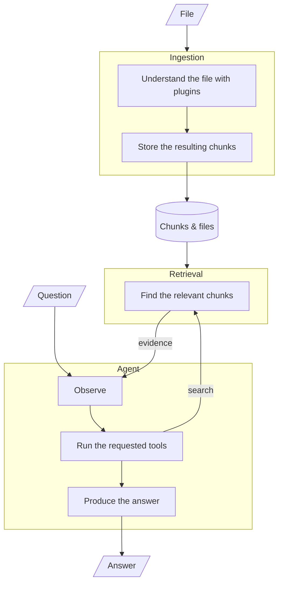
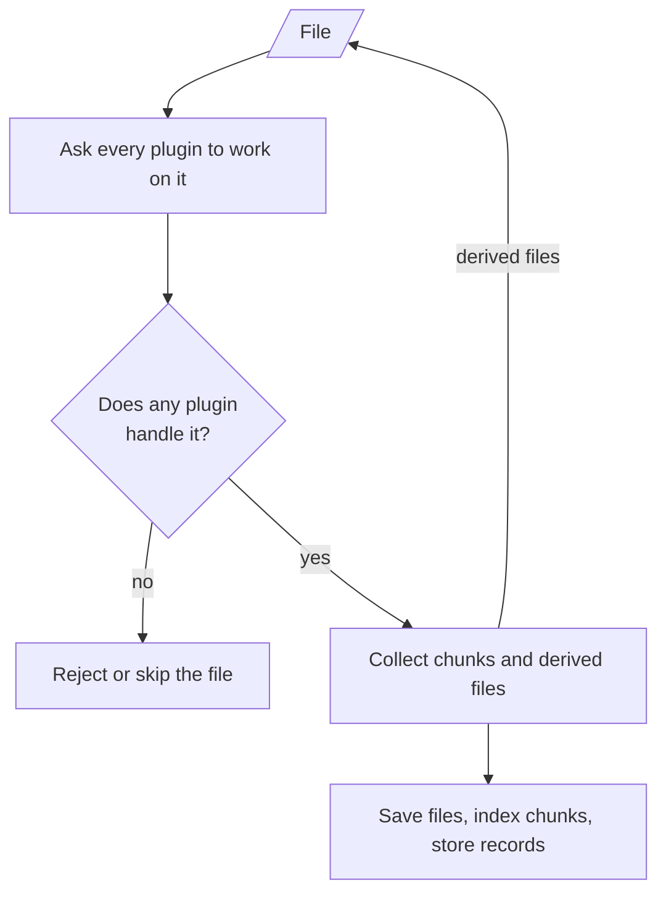
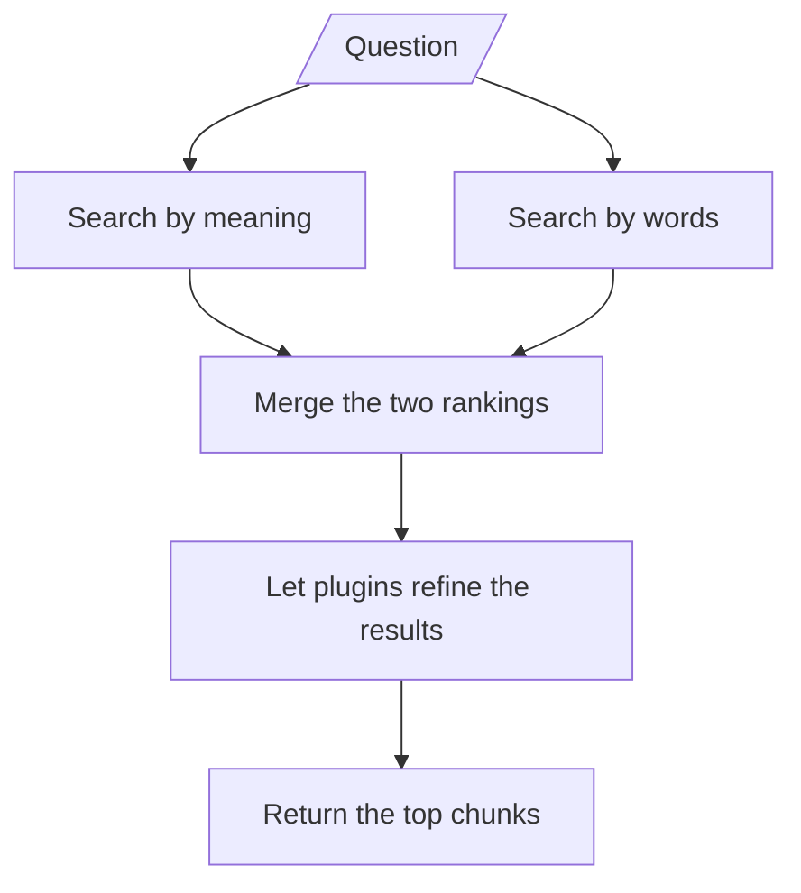
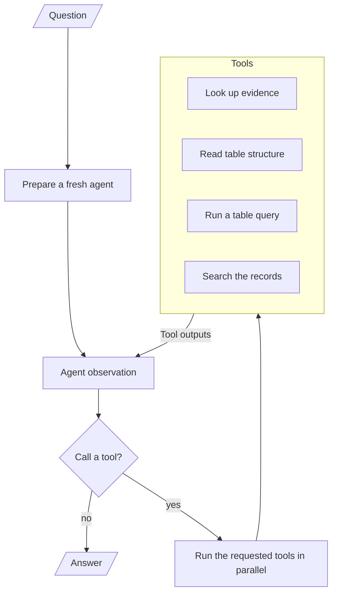
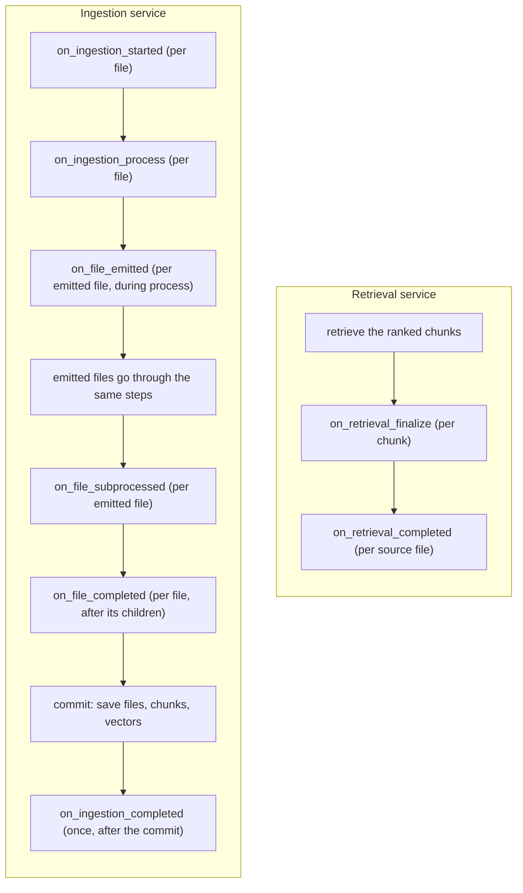

# Agentic RAG

An agentic Retrieval-Augmented Generation (RAG) pipeline built around a **plugin architecture** for document types. It ingests text documents and spreadsheets, creates searchable representations, retrieves relevant evidence using both semantic and lexical search, and uses an LLM to generate grounded answers.

The application is designed around separate ingestion, retrieval, and answer-generation stages. Document-type behavior lives in **plugins**, which the system discovers and orchestrates through a plugin registry and per-run contexts and runtimes.

## Table of Contents

- [Agentic RAG](#agentic-rag)
  - [Table of Contents](#table-of-contents)
  - [Features](#features)
  - [Running the Application](#running-the-application)
    - [Requirements](#requirements)
    - [Environment Configuration](#environment-configuration)
    - [Start the Application](#start-the-application)
    - [Talking to it](#talking-to-it)
  - [Architecture](#architecture)
    - [Ingestion Pipeline](#ingestion-pipeline)
    - [Retrieval Pipeline](#retrieval-pipeline)
    - [Answer Generation](#answer-generation)
  - [Users and Chats](#users-and-chats)
  - [Plugin Lifecycle](#plugin-lifecycle)
  - [Context and Runtime](#context-and-runtime)
  - [File Emission and Subprocess](#file-emission-and-subprocess)
    - [File descriptions](#file-descriptions)
    - [Text Plugin: Reassembling tables split across pages](#text-plugin-reassembling-tables-split-across-pages)
  - [Project Structure](#project-structure)
    - [`app/agent_tools`](#appagent_tools)
    - [`app/ingest`](#appingest)
    - [`app/plugin`](#appplugin)
    - [`app/plugins`](#appplugins)
    - [`app/api`](#appapi)
    - [`app/api_schemas`](#appapi_schemas)
    - [`app/core`](#appcore)
    - [`app/errors`](#apperrors)
    - [`app/database`](#appdatabase)
    - [`app/llm`](#appllm)
    - [`app/embedders`](#appembedders)
    - [`app/retrievers`](#appretrievers)
    - [`app/models`](#appmodels)
    - [`app/services`](#appservices)
    - [`app/store_file`, `app/store_sql`, `app/store_vector`](#appstore_file-appstore_sql-appstore_vector)
    - [`app/utils`](#apputils)
    - [`app/container.py`](#appcontainerpy)
  - [Design Principles](#design-principles)
  - [Tests](#tests)
  - [Extending the Application](#extending-the-application)
    - [Adding Another Plugin](#adding-another-plugin)
    - [Adding Another LLM Provider](#adding-another-llm-provider)
    - [Adding Another Embedding Provider](#adding-another-embedding-provider)
    - [Adding Another Retrieval Strategy](#adding-another-retrieval-strategy)
    - [Changing Storage Technology](#changing-storage-technology)

## Features

- **Plugin architecture.** Each document type is a plugin that decides which files it handles and how to turn them into searchable chunks. The built-in plugins are `TextPlugin` (text documents such as pdf, docx, txt, md, and html; it also detects embedded tables and images and hands them off for processing) and `TablePlugin` (spreadsheets: csv, xlsx, xls).
- **Hybrid retrieval.** Each question runs a semantic vector search and a lexical full-text search in parallel, and the two rankings are fused with Reciprocal Rank Fusion. Reworded questions and exact terms both find the right chunks.
- **Agentic answers.** Answers come from a tool-using agent (langgraph) that searches the corpus for evidence, inspects table schemas, and runs targeted SQL. It streams its tool steps and the answer token by token, and it supports multi-turn conversation.
- **Schema-first tables.** Each table's structure (column names and types) and shape are computed once at ingestion and stored on its chunk. The agent inspects that schema and writes SQL instead of reading table data, so inspecting a million-row table costs the same as a ten-row one.

## Running the Application

### Requirements

- Python 3.11+ (or Docker)
- An OpenAI API key for the LLM and a Google API key for the embedder
- Optionally, an Unstructured API key, if you partition documents through the hosted Unstructured API
- For local partitioning, Unstructured's system dependencies (poppler-utils, tesseract-ocr, libreoffice, libmagic1). The Docker image already includes them.

### Environment Configuration

Create a `.env` file in the root directory:

```env
OPENAI_API_KEY=your-openai-key
GOOGLE_API_KEY=your-google-key
UNSTRUCTURED_API_KEY=your-unstructured-key
```

`app/core/config.py` is the source of truth for all settings.

### Start the Application

With Python:

```bash
python -m venv venv
source venv/bin/activate
pip install -r requirements.txt
python -m run
```

The server listens on port 8000 with reload enabled for development, and the interactive API docs are at `http://localhost:8000/docs`.

With Docker:

```bash
docker compose up --build
```

`compose.yaml` builds the image (including Unstructured's system dependencies), exposes port 8000, and reads your `.env`. One note on data location: the storage settings default to `./.storage`, which inside the container is not the mounted `./storage` volume. To persist data on the host, set `FILE_LOCAL_STORAGE_DIR`, `SQL_LOCAL_STORAGE_DIR`, and `VECTOR_LOCAL_STORAGE_DIR` in `.env` to `/app/storage/file`, `/app/storage/sql`, and `/app/storage/vector`.

### Talking to it

The RAG endpoints are per-user and per-chat, authenticated by a session cookie. `stream_agent.py` handles all of that for you: on first use it registers and logs in a test account and keeps the session cookie in the OS temp dir, so you just run it.

- **Ask a question and watch the agent work:**

  ```bash
  python stream_agent.py "your question"
  ```

  The script prints each tool call and result as it happens, types out the answer token by token, and lists the chunks the answer cites at the end. Run it without arguments for an interactive conversation with chat management built in (`/chats`, `/use`, `/del`, and more; see `/help` in the script). Follow-up questions continue the server-side chat, and `RAG_CHAT=<chat_id>` continues a previous one.

- **Ingest files with curl** (a new chat is created when none is given; ingestion runs in the background and the response returns a `job_id`):

  ```bash
  # Log in once: -c saves the session cookie the server sets.
  curl -c cookies.txt -X POST localhost:8000/auth/login \
    -H "Content-Type: application/json" \
    -d '{"username": "you", "password": "your-password"}'

  # -b sends it. Send one or many files as repeated `files` parts.
  curl -b cookies.txt -X POST localhost:8000/rag/ingest \
    -F "files=@example_docs/a.pdf" -F "files=@example_docs/b.csv"
  # -> {"chat_id": "...", "jobs": [{"job_id": "...", "status": "queued", "file": "a.pdf"}, {"job_id": "...", "status": "queued", "file": "b.csv"}]}
  ```

- **Watch the ingestion progress** (a server-sent event stream, keyed by the `job_id` from the ingest response):

  ```bash
  curl -N -b cookies.txt "localhost:8000/rag/ingest/stream?job_id=<job_id>"
  ```

  Each file is its own job, so watch one file's stream per `job_id`. Frames arrive as the job runs: `chat`, a `queued` for the file, then `started`, `stage` (processing / saving / embedding), `plugin_state` (the plugins' own states, e.g. `partitioning`, `parsing_tables`, `reading_tables`, `analyzing_tables`), `file_done`, and a final `done` (or `error`). A client that connects late replays the frames already emitted.

- **JSON endpoints:** `POST /rag/ingest` (multipart, one or many `files`), `GET /rag/ingest/stream?job_id=...` (SSE progress), `POST /rag/retrieve?user_query=...`, `POST /rag/answer` (JSON body `{"query", "chat_id"}`), and `POST /rag/answer/stream` (same body, returned as a server-sent event stream). File endpoints: `GET /rag/files?chat_id=...` (the chat's files) and `GET /rag/files/{source_id}` (a file's metadata plus its `link`). Ingest endpoints: `GET /rag/ingest/jobs?chat_id=...` (the chat's ingest jobs and their progress). All take an optional `chat_id` (created automatically when absent) and require the session cookie.

## Architecture

The system is divided into three pipelines:

1. **Ingestion** turns uploaded files into searchable chunks.
2. **Retrieval** finds the chunks relevant to a question.
3. **The agent** answers questions by working through tools over the stored data.

They meet at the stored chunks: ingestion writes them, retrieval reads them, and the agent reads them through its tools.



### Ingestion Pipeline



You upload a file, and the pipeline does the following:

1. Every registered plugin is asked whether it handles the file. If none does, ingestion fails for an uploaded file (an emitted file is skipped with a warning).
2. The plugins that handle it run concurrently. Each one parses the file and returns searchable chunks, and each can hand off derived files (for example, a table found inside a pdf) back into the pipeline.
3. Every derived file goes through the same steps recursively, so a file's whole subtree is processed before the pipeline moves on.
4. Nothing is saved while the tree is walked. Once every file in the tree has processed successfully, the pipeline commits everything in one step: it stores the files, embeds and stores the chunks, and writes the chunk records. If any file fails, nothing is saved.

A document's content ends up in three stores: the original and derived files in the file store, one vector per chunk in the vector store, and one record per chunk (text and metadata) in the SQL store, which also powers the lexical search.

**In the background, with live progress.** `POST /rag/ingest` does not block on the work: it enqueues one job per file on an in-process queue and returns the job ids immediately. A small worker pool (`INGEST_WORKERS`, default 4) runs jobs in parallel, so the files of a single upload batch ingest concurrently. As a job runs it publishes progress events to a per-job, replayable in-memory bus, which `GET /rag/ingest/stream?job_id=...` serves as a server-sent event stream. The events have two layers: pipeline stages (`started`, `stage` for processing / saving / embedding, `file_done`, `done` / `error`) and fine-grained `plugin_state` events that plugins report themselves through the runtime (`partitioning`, `parsing_tables` for the text plugin; `reading_tables`, `analyzing_tables` for the table plugin). A client that connects mid-job replays the frames already emitted, so progress is never lost. `GET /rag/ingest/jobs?chat_id=...` lists a chat's jobs (one per file) with the progress buffered so far, which is how a client that closed (and then returned) sees where its ingests stand: it re-lists the jobs, reads each one's progress, and can re-attach to a still-running job's stream.

### Retrieval Pipeline



Retrieval runs two searches in parallel and merges their rankings:

- **Semantic search** embeds the question with the same embedder used for the chunks and finds the nearest vectors. The vector store keeps only ids and embeddings, so the matching chunk records are then loaded from SQL in the vector's ranking order.
- **Lexical search** runs full-text search (FTS5) over the chunk text in SQL.

The two rankings are combined with Reciprocal Rank Fusion (RRF). RRF merges ranks instead of scores, so the two searches contribute to one list even though they measure relevance differently. The top chunks then pass through a plugin finalization step (see Plugin Lifecycle) before they are returned.

### Answer Generation



Answering runs an agent built on langgraph. The agent loops between two steps: it asks the LLM (with the tools available), and when the LLM requests tools, it runs them and feeds the results back. Once the loop reached the max limits, the LLM is called without tools and must answer, so the loop always terminates.

The agent's tools are read-only lookups over the RAG system. They know nothing about plugins: a stored chunk is a table when its metadata carries a schema, and tables are addressed by their `source_id`.

- `search_documents`: hybrid retrieval over the corpus, through the same path the `/rag/retrieve` endpoint uses; each result carries its `source_id` (the handle for the table tools), `chunk_id`, `origin_source_id` (the citation key), and text.
- `validate_chunk_as_structured_data`: given a source id, reports whether the source is tabular (a csv or spreadsheet). If so, returns its table schema(s) as an array, one entry per sheet (a csv returns one; a multi-sheet workbook returns one per sheet), each with the table name and columns. The schemas come from the stored chunk metadata, so no table data is read.
- `perform_sql_to_document`: runs the model's targeted SQL (sqlite dialect) against a source's tabular data. The source's file is loaded into a throwaway in-memory database, one table per sheet for a workbook (each named by its `table_name`), so a workbook's sheets can be JOINed in one query. Non-spreadsheet sources are rejected; at most 5 result rows are returned. The only tool that reads table data.
- `perform_sql_to_document_records`: read-only SELECT over the stored chunk and document records, bounded to the chat.

The RAG tools are grouped into one `AgentToolset` (the `rag_toolset`), which carries the cross-tool orchestration instructions as guidance (find the source with `search_documents`; for tabular answers, `validate_chunk_as_structured_data` to learn the schema then `perform_sql_to_document` to run SQL, JOINing a workbook's sheets; `perform_sql_to_document_records` for inspecting stored data; and don't re-run a tool you already have). Each tool's own description stays decoupled and describes only itself; the "how these tools fit together" rules live in the toolset. The system prompt's tools section is generated from the toolset (`render_tool_blocks()`), so the prompt can never list a tool the agent does not have or miss one it does. The agent answers only from tool output; the prompt tells it to cite factual claims as `#[origin_source_id:chunk_id]` using the origin source and chunk ids the search tool returns (the citation format is owned by the agent service, the tools do not know about it). Citations use the `origin_source_id` (the top-level file the user uploaded) rather than the chunk's own `source_id`, so a citation for a table embedded in a document points at the document, not the intermediate emitted file. When the answer is done, those references are parsed out of the answer text: `RagAnswer.chunk_refs` holds exactly the chunks the answer cites (keyed by `#[origin_source_id:chunk_id]`), not everything it retrieved along the way.

**Streaming.** The LLM providers stream natively, and the run is forwarded as events: a token event per streamed token, a tool-call event per tool the model requests, a tool-result event per result, and a final answer event. `POST /rag/answer/stream` serves these as server-sent events (`answer_delta` frames as the answer types out, `tool_call` / `tool_result` frames while the agent works, then a final `answer` frame with the full answer JSON).

**Stopping.** The service tracks each chat's in-flight run (its driving task), so `POST /rag/stop` can interrupt a running answer: it cancels the run, abandoning the answer mid-way. The chat's checkpoint keeps whatever step had completed, so the next question resumes or starts fresh on the thread.

**Conversation.** The conversation lives in the chat, not in the request: each chat is a durable thread on the agent's checkpointer, so follow-ups resolve against earlier turns even after a server restart (see [Users and Chats](#users-and-chats)).

The layers, so each concern has one home:

- `app/services/rag_agent.py`: the `RagAgentService`. It takes the RAG service and the tools at initialization, owns the orchestration graph and the run events, composes a fresh run per answer, parses the answer's `chunk_refs` from its citations, and exposes `ask()` and `ask_stream()`.
- `app/agent_tools/`: the RAG tools, one module each (an `AgentTool` subclass per tool), plus the `rag_toolset` that groups them with their cross-tool instructions.
- `app/api/rag_agent.py`: the answer endpoints.

## Users and Chats

### Authentication

A small, self-contained auth domain (its own service, tables, and API module, decoupled from the RAG services). Sessions are cookie based:

- `POST /auth/register` with `{"username", "password"}` creates a user (passwords stored as bcrypt hashes).
- `POST /auth/login` verifies the credentials and sets the `auth_token` session cookie (HttpOnly, SameSite=Lax, Secure when `SESSION_COOKIE_SECURE`). The token it carries is opaque and stored only as a bcrypt hash, looked up by a unique token prefix; it never appears in a response body.
- `POST /auth/logout` clears the cookie.
- `GET /auth/me` returns the user of the session.

The RAG and chat endpoints require the session cookie (the `require_user` dependency in `app/api/auth.py` is the only seam between the auth domain and the rest of the API).

### Chats

A chat is a user's working space, and the unit of both the corpus and the conversation:

- **Ownership and auto-creation.** Every RAG endpoint takes an optional `chat_id`; without one, a chat is created for the calling user, and the response returns the id. Using someone else's chat id is a 403.
- **Corpus scope.** Ingesting into a chat stamps the chat id onto the file's records and its chunks (and the chunks' vector metadata), so retrieval is bounded to the chat natively: the vector leg filters the index by chat and the lexical leg filters the SQL rows. No chat id means the whole store. A fresh chat has an empty corpus.
- **Conversation thread.** The chat id is the agent's langgraph thread id. The graph runs on a checkpointer (durable SQLite via `langgraph-checkpoint-sqlite`, in `AGENT_LOCAL_STORAGE_DIR`, `.storage/agent` by default), so a conversation's messages persist across questions and server restarts. `GET /chats` lists a user's chats (with their ingested sources, derived from the documents table) so they can go back to an old one. `POST /chats` starts a new one explicitly. `GET /chats/{chat_id}/messages` returns the full conversation read from the checkpointer, in the same order and shape it was streamed: user questions, each tool call, each tool result, and each answer (with its citations).
- **Resume.** If a run stops before answering (for example the process dies), the next ask on that chat resumes from the checkpoint instead of starting over.

## Plugin Lifecycle

The pipeline is driven by a fixed set of lifecycle events. Each event is a method on the `Plugin` base class with a no-op default; plugins override only what they care about. The registry fires every event to **all** registered plugins (concurrently, in registration order), and each plugin decides for itself whether to act (typically by guarding with `accepts`, or by recognizing its own chunks via `chunk.plugin`). Every event receives the per-run context and the runtime of its phase: ingestion events carry `IngestionRuntime`, retrieval events carry `RetrievalRuntime`.

Where each hook is triggered in the two services:



Two events are **response events** (the service consumes what the plugins return):

- `on_ingestion_process`: plugins return the `IngestedChunk`s they generated (or `[]`); the service flattens them in registration order.
- `on_retrieval_finalize`: plugins return a replacement `RetrievedChunk` for chunks they produced, or `None` to leave the chunk unchanged; the service applies the last non-None replacement.

All other events are observational. Event-specific arguments come first; `context` and `runtime` are always the last two.

| Event                 | Plugin method            | Arguments                                      | Returns                  |
| --------------------- | ------------------------ | ---------------------------------------------- | ------------------------ |
| `ingestion_started`   | `on_ingestion_started`   | `context`, `runtime`                           | -                        |
| `ingestion_process`   | `on_ingestion_process`   | `context`, `runtime`                           | `list[IngestedChunk]`    |
| `file_emitted`        | `on_file_emitted`        | `emitted_file`, `context`, `runtime`           | -                        |
| `file_subprocessed`   | `on_file_subprocessed`   | `emitted_file`, `chunks`, `context`, `runtime` | -                        |
| `file_completed`      | `on_file_completed`      | `chunks`, `context`, `runtime`                 | -                        |
| `ingestion_completed` | `on_ingestion_completed` | `chunks`, `context`, `runtime`                 | -                        |
| `retrieval_finalize`  | `on_retrieval_finalize`  | `chunk`, `context`, `runtime`                  | `RetrievedChunk \| None` |
| `retrieval_completed` | `on_retrieval_completed` | `chunks`, `context`, `runtime`                 | -                        |

`file_completed` fires once per file in the emission tree (the file's `context`, the chunks of its whole subtree, and that file's `runtime`) after the file and all its emitted children are processed, before anything is committed. `ingestion_completed` fires once per ingestion, at the very end, after the commit.

Example: a plugin that generates chunks and audits ingestion:

```python
class AuditPlugin(Plugin):
    @property
    def name(self) -> str:
        return "audit"

    def accepts(self, context) -> bool:
        return context.file.filename.lower().endswith(".png")

    async def on_ingestion_process(self, context, runtime) -> list[IngestedChunk]:
        return [make_chunk(context)]

    async def on_ingestion_completed(self, chunks, context, runtime) -> None:
        print(f"[audit] {context.file.filename} -> {len(chunks)} chunks")
```

A new lifecycle point is added as a method on the `Plugin` base class (no-op default) and fired from the registry; there is no open event namespace.

## Context and Runtime

Plugin constructors take **options only, no services**. Lifecycle methods receive:

- **`IngestionContext`**: what is being ingested. `file` (an `IngestionFile`: the bytes, identity, auto-generated `source_id`, and optional `description`), `parent_file` (the file that emitted the current `file`, none if `file` is root), and `origin_file` (the original uploaded file).
- **`RetrievalContext`**: what is being retrieved: `user_query`. It is the retrieval-phase counterpart of `IngestionContext` and is passed to every retrieval lifecycle method.
- **`IngestionRuntime`**: the per-run state and shared services a plugin gets:

| Member                                                            | Purpose                                                                    |
| ----------------------------------------------------------------- | -------------------------------------------------------------------------- |
| `context`                                                         | The ingestion context for this run.                                        |
| `llm`                                                             | The LLM provider being used in the pipeline.                               |
| `embedder`                                                        | The embedding provider.                                                    |
| `vector_storage` / `sql_storage` / `file_storage`                 | The shared storages, for plugins that need to read or write other content. |
| `registry`                                                        | The plugin registry; `emit_file` reports emitted files through it.         |
| `emit_file(filename, content_type, file_bytes, description=None)` | Emit a file for subprocess by the plugins that accept it.                  |

Chunk and source persistence is not a runtime action. The ingestion service persists everything the plugins return: it embeds and stores chunk records, stores every file exactly once in `documents/`, and stores lineage as dedicated columns: `source_id` (the file the chunk came from), `parent_source_id` (the emitting file's `source_id`, `None` for top-level files), and `origin_source_id` (always set: the top-most file in the emission chain, so any chunk can be referenced back to the original document it descended from, not just its direct parent; a top-level file is its own origin). `IngestionContext` exposes the matching `file`, `parent_file`, and `origin_file`.

On the retrieval side, the `RetrievalService` builds a per-run **`RetrievalContext`** (holding `user_query`) and a **`RetrievalRuntime`** exposing `context` and `llm`. Both are passed to every retrieval lifecycle method.

## File Emission and Subprocess

Plugins can emit files so embedded content is processed as its own document:

1. A plugin calls `runtime.emit_file(filename, content_type, file_bytes, description=None)` while handling `on_ingestion_process`. This builds a new `IngestionFile` (with its own auto-generated `source_id`).
2. After the hook completes, the `IngestionService` takes all emitted files and runs each one back through `ingest`, passing the emitting file as the `parent_file`: full pipeline, distinct source. Each emitted file is also stored in `documents/` (with `is_origin = False`), so embedded content like extracted tables and images is persisted alongside the original upload.
3. The emitted file is offered to all plugins again, and the one(s) that accept it process it.

### File descriptions

Context about a file travels on the file itself:

- `IngestionFile` carries an optional `description` and its own auto-generated, read-only `source_id`. Every file ingested (top-level or emitted) is a distinct source identified by `source_id`; lineage between an emitted file and the file that produced it is carried by `IngestionContext.parent_file`.
- Plugins can read the description via `context.file.description` for additional context. Chunks store their lineage as columns: `source_id` (the file they came from), `parent_source_id` (the emitting file's `source_id`, `None` for top-level files), and `origin_source_id` (always set: the top-most file in the emission chain, so any chunk can be referenced back to the original document it descended from, not just its direct parent; a top-level file is its own origin). `IngestionContext` exposes the matching `file`, `parent_file`, and `origin_file`.

This is how a plugin enriches content it hands off: the built-in `TextPlugin` emits each reassembled embedded table as a CSV whose description combines the parent file's `description` (if any) with the document text found around the table. `TablePlugin` then passes that context to its LLM. The same mechanism is used for images: `TextPlugin` emits each extracted image with a description (caption and nearby text), ready for an image plugin to consume.

The main use today is a text document with embedded tables: `TextPlugin` reassembles each parsed table and emits it as a CSV, and `TablePlugin` generates the searchable chunk for it. Embedded images are emitted with `runtime.emit_file`; until an image plugin accepts them the service logs that they were not accepted, but the figure's description is still indexed as a text chunk so the content stays searchable.

### Text Plugin: Reassembling tables split across pages

A table that spans a page break is parsed by Unstructured into separate table elements, one per page. `TextPlugin` walks the element stream in order and groups **runs** of tables: a run is a maximal sequence of table elements with only page furniture (page breaks, page numbers, headers, footers) between them. Any other element (text, an image, an unparseable table) ends the run, because that content genuinely separates the tables in the document. A bare page break does not.

Each run is handed to `merge_table_fragments` (in `app/plugins/text.py`, since the logic is specific to that plugin's parsing), which folds the fragments back into whole tables:

- a fragment whose header repeats the table's header is a continuation page: its header is dropped (kept once) and its rows appended;
- a fragment with **no** header is appended as raw data rows when its column count matches and its values are type-compatible with the table's existing rows (a column does not mix numbers with non-numeric text), which recovers continuations where the header was not repeated;
- anything else (different column count, different header, conflicting value types) starts a new table.

Each reassembled table is emitted as a CSV with a header row (generated `col_N` names when none was detected, so downstream readers treat row 0 as column names) and a description containing, up to `NEARBY_TEXT_CHARS` (default 500) characters of the document text found immediately before and after the table.

## Project Structure

### `app/agent_tools`

The RAG agent's tools, plugin-style: one module per tool (`search_documents.py`, `validate_chunk_as_structured_data.py`, `perform_sql_to_document.py`, `perform_sql_to_document_records.py`), plus `base.py` (the `AgentTool` and `AgentToolset` base classes and the outline/render helpers), `common.py` (the shared source/table resolution, spreadsheet loading, and in-memory SQL helpers), and `rag_toolset.py` (the `AgentToolset` that groups the RAG tools with their cross-tool instructions). The tools are decoupled from the plugins: they only know the `rag_service` (and the `chat_id`), and treat a stored chunk as a table when its metadata carries a schema.

`AgentTool` declares the tool's `name`, `description`, and `parameters` (the JSON schema the model sees) and implements `create_executor(rag_service, chat_id)`, which returns the async execute function the agent uses (a closure over the RAG service pieces it needs; the RAG service exposes its collaborators as public properties for this). Each tool's description is decoupled and describes only itself. Tools are read-only and token-lean: `validate_chunk_as_structured_data` returns a source's stored table schema(s) with no data read, and `perform_sql_to_document` loads a source's spreadsheet (a csv, or a workbook's sheets, each named by its `table_name`) into a throwaway in-memory database and caps output at 5 rows.

`AgentToolset` is a named group of tools plus the cross-tool orchestration instructions (e.g. "validate a source's schema before running SQL over it"). It is transparent to the tool-call wire format (the model calls its member tools), and its `render()` block (name + instructions + each tool's spec) is what the agent's system prompt shows. `flatten_tools()` unwraps a mix of bare tools and toolsets into the tools the model actually calls; `render_tool_blocks()` renders that mix for the prompt; `tools_outline()` renders a bare set of tools' specs. `rag_toolset.py` declares the RAG tools one by one as module constants (so the instructions can reference their real names) and the `RAG_TOOLSET` constant (named "RAG") that groups them.

### `app/ingest`

The ingest-specific progress layer, built on the generic queue/bus in `app/utils`. It is decoupled from both the pipeline and the transport:

- `events.py`: `ProgressEmitter`, the publishing side the pipeline and plugins hold (its methods map to the ingest event names). It writes into the generic `EventBus`.

The ingest event *names* live in `app/models/ingest.py` (`chat` / `queued` / `started` / `stage` / `plugin_state` / `file_done` / `done` / `error`, plus `INGEST_TERMINAL`). The generic event type, bus, job, and queue are in `app/utils` (below), so any subsystem can reuse them.

### `app/plugin`

The plugin framework: the `Plugin` base class with its overridable lifecycle methods, `IngestionFile` / `IngestionContext`, `IngestionRuntime` / `RetrievalRuntime`, and the `PluginRegistry` that fires events to all plugins. `IngestionFile` is the unit of ingestion (a file's bytes, an auto-generated `source_id`, and an optional `description`), used both at the API boundary (built by the RAG service from the upload) and for files a plugin emits for subprocess. `IngestionContext` is `file` + `origin_file` + `parent_file`. `IngestionRuntime` also exposes `report_state(state, **detail)`, through which a plugin announces its own fine-grained progress (e.g. `partitioning`, `analyzing_tables`) on a background ingest; the registry attributes each call to the plugin via a context variable, so the plugin never passes its own name.

### `app/plugins`

Built-in document-type plugins. Each module contains one `Plugin` subclass.

#### `app/plugins/text.py`

`TextPlugin` handles text documents (pdf, docx, txt, md, html, and more). It parses the source with Unstructured.io (locally, or through the hosted API when `use_api=True`), chunks the text (`chunk_by_title` when titles are present, otherwise `chunk_elements`), and manages the embedded content:

- **Embedded tables** are reassembled across page breaks (see [Text Plugin: Reassembling tables split across pages](#text-plugin-reassembling-tables-split-across-pages)) and emitted as CSVs for the `TablePlugin` to process.
- **Embedded images** are emitted with a description (caption and nearby text) for a future image plugin, and each figure's description is indexed as its own text chunk so the content stays searchable.

Constructor options: `ignore_images` and `ignore_tables` (both default `False`) skip the processing of embedded images or tables (an ignored image still separates table runs in the document stream), and `use_api` / `api_key` switch partitioning to the hosted Unstructured API.

#### `app/plugins/table.py`

`TablePlugin` handles spreadsheets (csv, xlsx, xls) and the table CSVs emitted by `TextPlugin`. It reads the file with pandas (one table per sheet), keeping table and column names exactly as they came from the file (no normalization, deduplication, or renaming).

It asks the LLM for one workbook-level pass that produces retrieval-optimized descriptions: the workbook meaning and a description for each table. The result is one chunk per table:

- **searchable text**: the table name, workbook context, the table's description, and a small sample of its rows.
- **metadata**: `table_name`, the precomputed `schema` (column names and inferred types), `row_count`, and `column_count`. For tables embedded in a parent document, the metadata also carries the `source_page_number` inherited from the parent's chunks. The description is not duplicated into the metadata; it is already in the text.

Storing the schema is what lets the agent inspect a table without reading its data. The table data itself stays a file (the uploaded spreadsheet, or the emitted CSV for embedded tables), linked from the chunk record. The agent reads it through `perform_sql_to_document`, which loads a source's spreadsheet into a throwaway in-memory database (a csv as one table; a workbook's sheets each as a table named by their `table_name`) and runs SQL over it, so a workbook's sheets can be JOINed. The plugin does not emit or store any file of its own, and table rows are not loaded into SQL at ingestion.

### `app/api`

Contains the FastAPI HTTP routes, split by domain: auth in `auth.py` (which also holds the `require_user` dependency and the session cookie), chats in `chats.py`, the RAG routes (ingest/retrieve) in `rag.py`, and the answer routes in `rag_agent.py`. The RAG and chat routes require the session cookie; every RAG route takes an optional `chat_id` (created automatically when absent) and returns it.

#### `app/api/auth.py`

- `POST /auth/register`: creates a user.
- `POST /auth/login`: verifies credentials, sets the session cookie.
- `POST /auth/logout`: clears the session cookie.
- `GET /auth/me`: the user of the session.
- `require_user`: the FastAPI dependency the other routers use for authentication (reads the session cookie).

#### `app/api/chats.py`

- `GET /chats`: the caller's chats (with their ingested sources). This is how a user goes back to an old chat.
- `POST /chats`: starts a new chat explicitly.
- `GET /chats/{chat_id}/messages`: the chat's full conversation, in the same order and shape it was streamed: user questions, tool calls, tool results, and answers (each answer carries its `chunk_refs`). Read from the agent's checkpointer.
- `DELETE /chats/{chat_id}`: deletes a chat entirely: its files, chunks, vectors, and conversation history (then its row). Ownership-checked.

#### `app/api/rag.py`

Contains the RAG endpoints, backed by the `RagService`:

- `/rag/ingest`: accepts one or many files (repeated `files` parts, or a single legacy `file` part) and queues them for background ingestion; the response returns the `chat_id` and the `job_id` (the work happens on the ingest queue, not in the request).
- `/rag/ingest/stream`: the job's progress as a server-sent event stream (keyed by `job_id`, ownership-checked; late subscribers replay the frames already emitted).
- `/rag/ingest/jobs?chat_id=...`: the chat's ingest jobs (one per file, queued, running, and finished), each with its status, file, and the progress events buffered so far. This is how a client that closed and returned sees where its ingests stand: a running job shows its progress up to now (and its stream can be re-attached via `/rag/ingest/stream`), a finished one shows its full progress.
- `/rag/retrieve`: retrieves relevant chunks bounded to the chat's corpus.
- `/rag/files` (GET): the origin files ingested into the chat (user uploads, not the files plugins emitted), each with its `source_id`.
- `/rag/files/{source_id}` (GET): one stored file's metadata (filename, content type, `is_origin`, chat) plus the `link` to retrieve its bytes. 404 for a missing file or one the caller does not own.
- `/rag/files/{origin_source_id}/chunks` (GET): all chunks of one file's emission tree (its own chunks plus every emitted descendant's), found via `origin_source_id`.
- `/rag/files/{origin_source_id}` (DELETE): reverse ingestion for one file's whole emission tree (its chunks, vectors, SQL records, and stored files). Returns 404 when the file is not in the chat.

#### `app/api/rag_agent.py`

Contains the answer endpoints, backed by the `RagAgentService`:

- `/rag/answer`: JSON body `{"query", "chat_id"}`; the answer for the question on that chat's conversation thread and retrieval scope.
- `/rag/answer/stream`: the same body; a `chat` frame naming the chat, then the agent run as a server-sent event stream (an `answer_delta` frame per streamed token, a `tool_call` frame per tool it requests, a `tool_result` frame per result it reads, and one final `answer` frame carrying the JSON `RagAnswer`).
- `/rag/stop`: JSON body `{"chat_id"}`; interrupts the in-flight answer on that chat (if any) and returns `{"chat_id", "stopped"}`. Ownership-checked like the other chat routes.

### `app/api_schemas`

Contains Pydantic models used specifically at the API boundary. These are separate from the application's internal dataclasses so internal objects can contain fields that should not be exposed through JSON responses.

### `app/core`

Application-wide configuration and core infrastructure.

- `app/core/config.py` - settings (API keys, model names, storage paths, the vector collection name, and the agent storage directory).
- `app/core/exceptions.py` - exception handlers registered on the FastAPI app.

### `app/errors`

Domain-specific errors: `InvalidDocumentError` for unsupported/invalid uploads, `UserExistsError` / `AuthError` for auth, and `ChatNotFoundError` / `ChatForbiddenError` for chats. `app/core/exceptions.py` maps them to HTTP status codes (409, 401, 404, 403).

### `app/database`

The database schema, one SQLAlchemy ORM model per table (one file per table), all mapped onto a shared declarative `Base`. The `__tablename__` literal in each model is the single source of truth for the table name (there are no table-name constants in config). The SQL storage's `create_tables()` applies the schema with `Base.metadata.create_all`. The ingestion models (`Chunk`, `Document`) set `__expose_docs_to_agent__ = True` and carry a class doc plus a `doc` on every column; `agent_table_docs()` renders those into the agent's system prompt (a "Records" section), so the model learns the table structure and the origin / parent / source id semantics from the schema itself rather than a hand-maintained copy.

- `app/database/base.py` - the declarative `Base`.
- `app/database/chunks.py` - `Chunk` (`__chunks__`): the searchable pieces, with the origin/parent/source id columns.
- `app/database/documents.py` - `Document` (`__documents__`): the stored files (origin + emitted), with `is_origin`.
- `app/database/chats.py` - `Chat` (`__chats__`): a user's working space and conversation thread.
- `app/database/users.py` - `User` (`__users__`): username + bcrypt password hash.
- `app/database/auth_tokens.py` - `AuthToken` (`__auth_tokens__`): hashed session tokens.
- `app/database/__init__.py` - re-exports the table-name constants, the models, `Base`, and `agent_table_docs()`.

### `app/llm`

- `app/llm/base.py` - the `LLMProvider` interface: the wire types (`ChatMessage`, `ImageContent`, `ToolSpec`, `ToolCall`, `RawDelta`, `ChatResult`) and the public surface. A `ChatMessage`'s content is a plain string or a list of text and image parts (vision). Providers implement one raw primitive (`stream_complete`, a token-level stream of `RawDelta`s (text pieces and whole tool calls) that accepts any combination of tools and a JSON schema), and assume full native model support (tool calling, structured outputs, and vision). The base class provides `complete` (the stream accumulated into one `RawResult`) and `answer` (plain text), `chat` (native tool calling), and `structured` (native JSON-schema output, validated with pydantic) as thin compositions of it. There are no fallback strategies: if the model or endpoint cannot comply, the error propagates.
- `app/llm/openai.py` - the OpenAI-compatible implementation (custom `base_url` supported, for example a routing endpoint).
- `app/llm/gemini.py` - the Gemini implementation.

### `app/embedders`

- `app/embedders/base.py` - the `Embedder` interface.
- `app/embedders/fastembed.py` - local embeddings via fastembed.
- `app/embedders/sentence-transformers.py` - local embeddings via huggingface.
- `app/embedders/gemini.py` - the Gemini embedding implementation.

### `app/retrievers`

- `app/retrievers/base.py` - the `Retriever` interface (`retrieve(user_query, chat_id=None)`).
- `app/retrievers/vector.py` - dense retrieval via Chroma (bounded to a chat through the stored `chat_id` vector metadata), re-loading chunk records from SQL.
- `app/retrievers/sparse.py` - lexical retrieval via FTS5 (bounded to a chat with a SQL filter).
- `app/retrievers/hybrid.py` - runs retrievers concurrently and merges rankings with RRF.

### `app/models`

Internal application models.

- `app/models/chunk.py` - `IngestedChunk` and `RetrievedChunk`. Both carry `plugin` (the name of the plugin that produced the chunk), which is how retrieval routes chunks back to their finalizer; `RetrievedChunk` also carries `chat_id` (the chat the chunk was ingested into).
- `app/models/rag.py` - `RagAnswer` (query, answer, and `chunk_refs`: the chunks the answer cites, keyed by `#[origin_source_id:chunk_id]`).
- `app/models/stream.py` - `StreamEvent`: the neutral item the answer stream yields (a wire event name plus a payload), so the API never sees the agent's event types.
- `app/models/ingest.py` - the ingest progress event names (`chat` / `queued` / `started` / `stage` / `plugin_state` / `file_done` / `done` / `error`) and `INGEST_TERMINAL`. The neutral `Event` type itself lives in `app/utils/events.py`.
- `app/models/vector.py` - `VectorSearchResult`.

### `app/services`

- `app/services/auth.py` - the auth domain (decoupled from the RAG services; needs only SQL storage): `register`, `login` (bcrypt-hashed passwords, opaque hashed tokens), and `verify_token`.
- `app/services/chat.py` - user chats: `get_or_create` (ownership-checked), `create`, `delete`, `username_of`, and `list_chats` (a chat's ingested sources are derived from the documents table, so there is no separate bookkeeping).
- `app/services/ingestion.py` - the pipeline driver: offers each file to all plugins, builds context/runtime (carrying the chat id), runs `on_ingestion_process` on every plugin, persists everything (source files, chunk records, vectors) stamped with the chat id, and re-ingests emitted files. It also manages stored files: `list_files(chat_id)` (origin uploads only), `list_file_chunks(origin_source_id, chat_id)` (a file's whole emission tree via `origin_source_id`), `delete_file(origin_source_id, chat_id)` (reverse ingestion for one file's tree: its chunks, vectors, SQL records, and stored files), and `delete_chat(chat_id)` (reverse ingestion for a whole chat: its chunks, vectors, document records, and stored files). It also reads stored files: `get_file_metadata(source_id)` (the document record) and `get_file_link(source_id)` (the URL to retrieve the file, built via the file storage's `create_link`). `ingest(file, chat_id, emitter=None)` optionally takes a `ProgressEmitter` and reports pipeline stages (`processing` / `saving` / `embedding`) to it as the file's tree is walked.
- `app/services/retrieval.py` - runs the hybrid retriever (bounded to a chat when given) and runs `on_retrieval_finalize` on every plugin for each chunk.
- `app/services/rag.py` - the wrapper for ingestion and retrieval. It builds the `PluginRegistry` from the `plugins` option and the ingestion and retrieval services (which take the registry) from the collaborators it is given, and exposes those collaborators as public properties so the agent's tools can use them. `ingest(file_bytes, filename, content_type, description=None, chat_id=None)` builds the `IngestionFile` and delegates, returning the origin source id with the chunks. `retrieve(user_query, chat_id=None)` returns evidence bounded to that chat's chunks when given. It also delegates the file-management methods: `list_files`, `list_file_chunks`, `delete_file`, `delete_chat`, `get_file_metadata`, and `get_file_link`. It owns the background ingest queue: `start_ingest_queue()` / `stop_ingest_queue()` (called from the lifespan), `enqueue_ingest(files, chat_id)` (queues one job per file and returns the jobs), `get_ingest_job(job_id)`, and `list_ingest_jobs(chat_id)` (the chat's jobs, each with its buffered progress events).
- `app/services/rag_agent.py` - the `RagAgentService`: takes the RAG service and the tools (or toolsets) at initialization, and owns the orchestration graph (built on a checkpointer, one thread per chat), the per-run chat scoping, the run's events, `chat_history` (a chat's full conversation read from the checkpointer: user questions, tool calls, tool results, and answers, in stream order), the system prompt (a template whose tools block is rendered from the passed tools and toolsets via `render_tool_blocks`, so each toolset's cross-tool instructions and every tool's spec appear, and whose Records section is rendered from the ingestion tables' own class and column docstrings via `agent_table_docs`, so the model knows the table structure and the origin/parent/source id semantics without a hand-maintained copy), the citation format (`CHUNK_REF_PATTERN`, `extract_chunk_refs`: the single source of truth for `#[origin_source_id:chunk_id]`), and the translation of a run into neutral `StreamEvent`s. `ask(question, chat_id=)` returns the `RagAnswer`. `ask_stream(...)` yields the run ending with it. Interrupted runs resume from their checkpoint. `stop(chat_id)` interrupts a chat's in-flight run (it tracks each run's driving task and cancels it, returning whether a run was stopped). `delete_chat(chat_id)` deletes a chat's RAG data (via the RAG service) and its conversation history (the checkpointer thread).

### `app/store_file`, `app/store_sql`, `app/store_vector`

Storage abstractions and local implementations:

- `FileStorage` - upload/delete/read files, and `create_link(full_path)` (a pure path-to-URL mapping used to build a file's retrieval link). Local implementation stores everything under `.storage/file/documents/`: the original user uploads (`is_origin = True` in `__documents__`) and every file a plugin emits (`is_origin = False`). Its `create_link` returns `/files/<stored name>` (the stored name is a unique uuid). Each file is stored exactly once, when it goes through ingestion. There is no separate chunk-file storage.
- `SqlStorage` - upserts, read-only queries, and FTS5 search (with an optional chat filter), plus `create_tables()` to apply the schema. Local implementation is one SQLite database holding the tables defined in `app/database` (the ingestion tables `__chunks__` and `__documents__` both carry a `chat_id` column); `create_tables()` runs `Base.metadata.create_all`, creating only the tables that are absent.
- `VectorStorage` - stores chunk IDs + embeddings (+ optional metadata, for example the chat id), cosine search with an optional metadata filter. Local implementation is a persistent Chroma collection.

### `app/utils`

- `app/utils/events.py` - the generic progress primitives: `Event` (a name plus a payload dict) and `EventBus`, a per-job replayable in-memory pub/sub (a buffer plus live subscribers, with no gaps or duplicates because publishing is synchronous; the stream ends when an event whose name is in the configured `terminal` set is published). Domain-agnostic: any subsystem can reuse it.
- `app/utils/queue.py` - the generic background-job machinery: `Job` (an id, a status, an `EventBus`, a `payload`, and an optional shared `group`) and `JobQueue` (an asyncio queue with a small worker pool and a job registry). The queue runs a `process_job` callback supplied by the domain layer and owns ordering, concurrency, and lifecycle status only; it publishes no domain events except the terminal error event (built by a supplied factory) when a job raises.
- `app/utils/ranking.py` - RRF ranking.
- `app/utils/string.py` - brace-safe prompt template rendering.

### `app/container.py`

The composition root for the external collaborators. It builds the providers, storages, retrievers, and built-in plugins, then composes the services: `AuthService` and `ChatService` (which get SQL storage), the `RagService` wrapper (which gets the plugins through its `plugins` option), and the `RagAgentService` (which gets the RAG service, the RAG tools, and the agent storage directory its checkpoint database lives in). It also exposes the FastAPI lifespan (creating the schema with `sql_storage.create_tables()`, opening the agent's checkpoint database, then closing the agent checkpoint, SQL, and vector databases on shutdown). The pipeline internals (the plugin registry and the ingestion/retrieval services) are composed inside the `RagService`.

## Design Principles

- **The pipeline is the plugin lifecycle.** Services fire a fixed set of lifecycle events through the registry; plugins react by overriding the matching methods, with data (chunks, replacement chunks) or observations. There is no per-type dispatch in the system and no open event namespace.
- **Plugins own document types.** A plugin decides which files it wants to manage (`accepts`) and overrides the ingestion/retrieval lifecycle methods for them. The system does not special-case document types and offers every file to all plugins.
- **Services own chunk and source persistence.** Plugins generate and return data; the ingestion service is the only component that embeds, stores, or commits chunks, files, and vectors (the storages are exposed on the runtime for other plugin needs).
- **Context and runtime, not globals.** Lifecycle methods receive everything they need per run: a read-only context (document details) plus a runtime (shared services such as the LLM, embedder, and storages, and `emit_file`). Plugin constructors take options only, never services.
- **Decoupled stores and providers.** Storage and AI providers sit behind small interfaces (`FileStorage`, `SqlStorage`, `VectorStorage`, `LLMProvider`, `Embedder`).
- **Native LLM capabilities, no silent fallbacks.** Both providers assume the model natively supports tool calling, structured outputs (JSON schema), and vision. There is no degraded prompt-based path: if the model or endpoint cannot comply, the error propagates to the caller.
- **The wrappers compose, the container injects.** The container supplies the external collaborators (LLM, embedder, retriever, storages, plugins) and composes the services from them. `AuthService` and `ChatService` are standalone (they need only SQL storage). `RagService` composes the ingestion/retrieval internals (the plugin registry and its two services) and owns the background ingest queue. `RagAgentService` composes the answering agent (the RAG service plus the tools passed in at initialization). The API layer only ever talks to the services.
- **Ingestion is a background job with a neutral progress stream.** `POST /rag/ingest` enqueues files and returns a `job_id`. A worker pool runs the jobs, and each job publishes neutral events (pipeline stages plus the plugins' own `plugin_state`s, reported through the runtime) to a per-job replayable bus. The SSE endpoint serializes those events without knowing about ingestion, and late subscribers replay the frames already emitted. The generic queue and bus (`app/utils/queue.py`, `app/utils/events.py`) are fully domain-agnostic and reusable by any subsystem. The ingest-specific pieces (the event names in `app/models/ingest.py` and the `ProgressEmitter` in `app/ingest/`) sit on top. Both layers are decoupled from the pipeline and the transport, so either can be swapped (e.g. a broker-backed queue for multi-instance) without touching the other.
- **Chats scope the data.** Everything a user does happens in a chat: ingestion stamps the chat id onto the file's records, chunks, and vector metadata, retrieval and the agent's tools are bounded to the chat natively (at the index, not by post-filtering), and the conversation is the chat's checkpointed thread. Auth is a separate domain (its own service, tables, and API module) that the other routers reach only through the `require_user` dependency.
- **The agent is part of the RAG service layer, and its tools are plugins.** The orchestration graph, the run events, and the system prompt live in `app/services/rag_agent.py`. Tools are `AgentTool` subclasses in `app/agent_tools/`, grouped into `AgentToolset`s, and passed to `RagAgentService` at initialization (it accepts a mix of bare tools and toolsets). Each tool's executor is created per answer with the RAG service and the chat id, and each toolset's cross-tool instructions are rendered into the system prompt. The RAG service itself never builds the agent, and the API consumes neutral `StreamEvent`s. Adding a tool means adding one `AgentTool` subclass and adding it to the relevant toolset. Adding a document type still touches only `app/plugins/`.
- **Tables are queried, not read.** A table's schema and shape are computed at ingestion and stored in its chunk metadata (the description stays in the chunk's text), so the agent inspects a table's schema from metadata with `validate_chunk_as_structured_data` (no data read) and writes targeted SQL for `perform_sql_to_document` (a csv, or a workbook's sheets, JOINable). Whole tables are never dumped into the model's context; at most a handful of result rows are returned.
- **Text and images to the LLM, nothing else.** Messages carry text and image parts (vision); no other binary attachments anywhere in the pipeline.

## Tests

The test suite lives in `tests/` and runs with:

```bash
python -m pytest tests
```

It exercises the auth and chat services (against real local SQLite), the plugin lifecycle, both built-in plugins, the ingestion and retrieval pipelines end to end (with real local storage and stubbed external calls), chat-scoped retrieval and tools, the LLM strategies, and the RAG agent (tools, the tool-calling loop, streaming, citation parsing, and chat continuity/resume on a checkpointer) with scripted fake LLMs.

## Extending the Application

### Adding Another Plugin

1. Create a module in `app/plugins/` with a `Plugin` subclass. The constructor may take plugin options (tunables, thresholds) but never services; the LLM is available on `runtime.llm` in both phases.
2. Give it a unique `name` and implement `accepts(context)`: decide which files this plugin wants to manage. A plugin may accept as many document shapes as it likes; multiple plugins may accept the same file and will all run.
3. Override `on_ingestion_process` to generate `IngestedChunk`s (set `plugin=self.name` on each so retrieval can route them back, and emit embedded content with `runtime.emit_file`). Do any parsing you need inside the method. The service never parses for you. Return the chunks. The service persists them.
4. Optionally override `on_retrieval_finalize` for query-aware enrichment: return a replacement chunk for chunks where `chunk.plugin == self.name`, or `None` otherwise.
5. Add it to the `plugins` option of `RagService` in `app/container.py`, alongside the built-in `TextPlugin` and `TablePlugin`.

### Adding Another LLM Provider

Implement `LLMProvider` and provide the new implementation to the container.

### Adding Another Embedding Provider

Implement `Embedder` without changing retrieval or ingestion.

### Adding Another Retrieval Strategy

Implement `Retriever` and include it in the `HybridRetriever`; the RRF merge combines its ranked results with the others.

### Changing Storage Technology

The storage interfaces allow the current local implementations to be replaced with other backends.

For example:

```text
LocalSqlStorage    -> PostgreSQL implementation
LocalFileStorage   -> S3 bucket
LocalVectorStorage -> Alternative vector database
```

The services and plugins remain unchanged as long as the replacement implements the corresponding interface.
