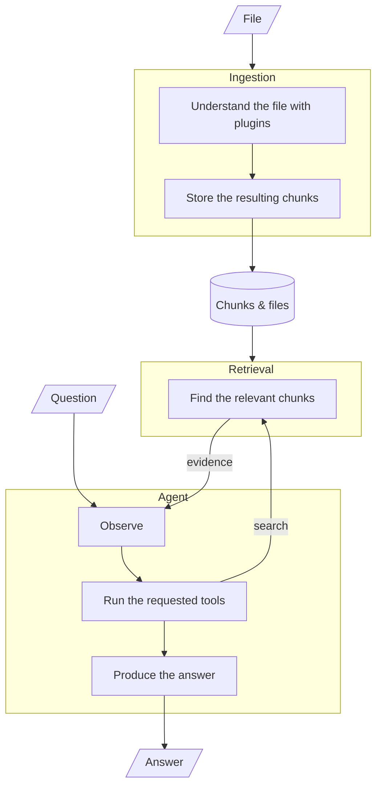
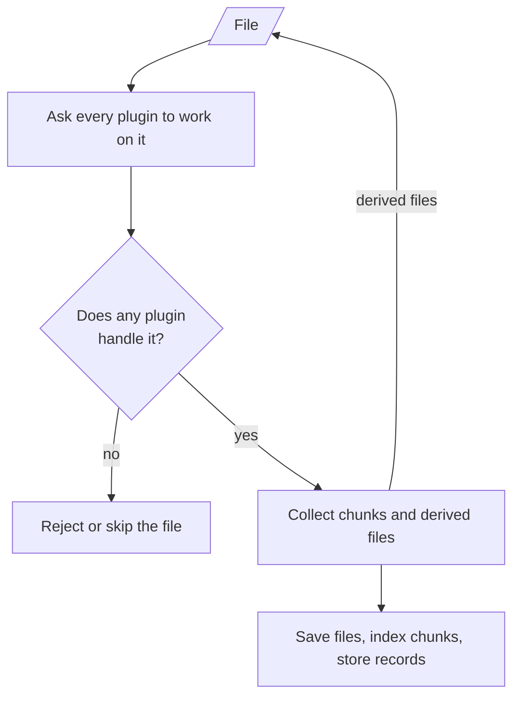
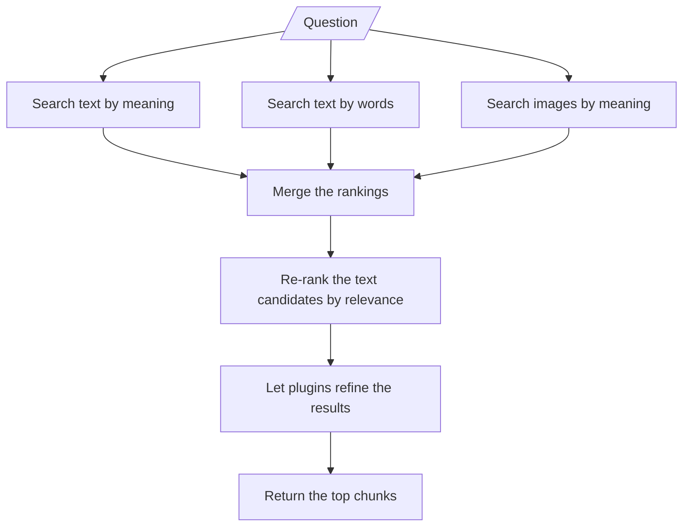
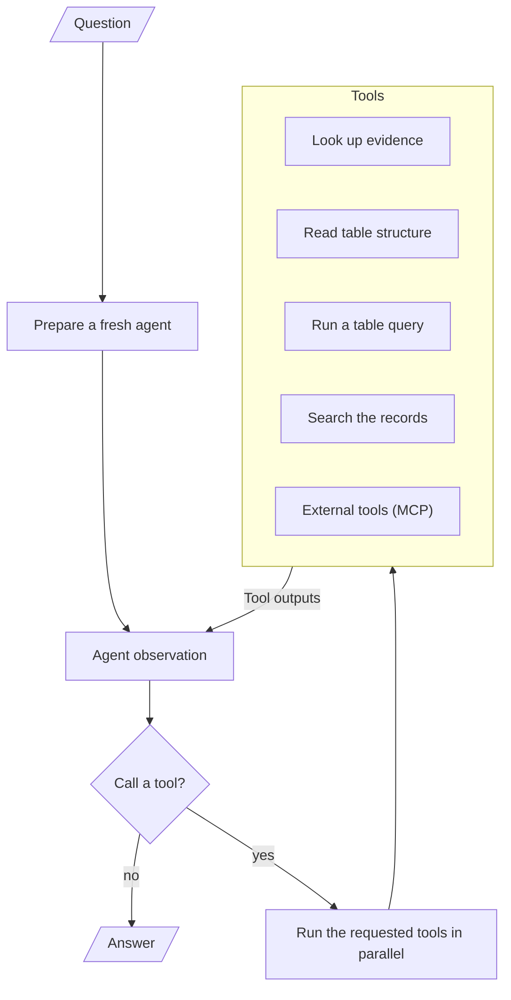
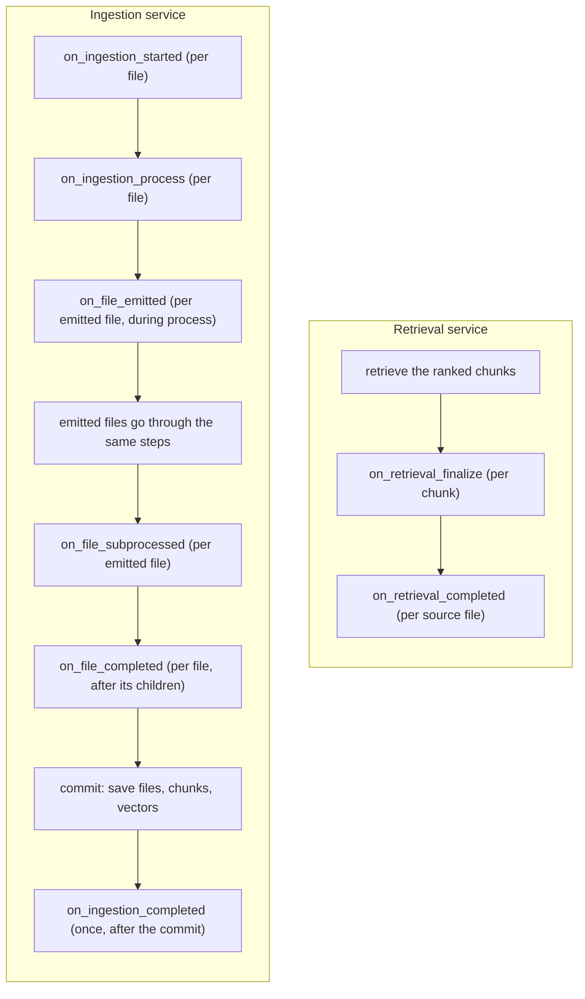

# Agentic RAG

An agentic Retrieval-Augmented Generation (RAG) pipeline. You upload files (documents, spreadsheets, images); it ingests them into a searchable corpus, and an LLM agent answers questions by retrieving evidence and, for tables, running SQL against the stored data.

It is built around a **plugin architecture** for extensibility: each document type is a plugin that the system discovers and orchestrates, and the work is split into separate ingestion, retrieval, and answer-generation stages.

https://github.com/user-attachments/assets/6a188067-d639-47d0-8653-211868a2e979

## Table of Contents

- [Agentic RAG](#agentic-rag)
  - [Table of Contents](#table-of-contents)
  - [Features](#features)
  - [Running the Application](#running-the-application)
    - [Requirements](#requirements)
    - [Environment Configuration](#environment-configuration)
    - [Start the Application](#start-the-application)
    - [Talking to it](#talking-to-it)
  - [Deployment](#deployment)
  - [Architecture](#architecture)
    - [Ingestion Pipeline](#ingestion-pipeline)
    - [Retrieval Pipeline](#retrieval-pipeline)
    - [Answer Generation](#answer-generation)
  - [Users and Chats](#users-and-chats)
    - [Authentication](#authentication)
    - [Chats](#chats)
  - [Plugin Lifecycle](#plugin-lifecycle)
  - [Context and Runtime](#context-and-runtime)
  - [File Emission and Subprocess](#file-emission-and-subprocess)
    - [Text Plugin: reassembling tables split across pages](#text-plugin-reassembling-tables-split-across-pages)
  - [Project Structure](#project-structure)
  - [Design Principles](#design-principles)
  - [Tests](#tests)
  - [Extending the Application](#extending-the-application)
    - [Adding Another Plugin](#adding-another-plugin)
    - [Adding Another LLM Provider](#adding-another-llm-provider)
    - [Adding Another Embedding Provider](#adding-another-embedding-provider)
    - [Adding Another Retrieval Strategy](#adding-another-retrieval-strategy)
    - [Adding an Agent Tool](#adding-an-agent-tool)
    - [Changing Storage Technology](#changing-storage-technology)

## Features

- **Plugin architecture.** Each document type is a plugin that decides which files it handles and how to turn them into searchable chunks. The built-in plugins are `TextPlugin` (text documents such as pdf, docx, txt, md, and html; it also detects embedded tables and images and hands them off), `TablePlugin` (spreadsheets: csv, xlsx, xls), and `ImagePlugin` (png, jpg, jpeg, webp, and more).
- **Hybrid retrieval.** Each question runs a semantic vector search (over both text and images) and a lexical full-text search in parallel, fuses the rankings with Reciprocal Rank Fusion, and re-ranks the result with a cross-encoder. Reworded questions and exact terms both find the right chunks.
- **Agentic answers.** Answers come from a tool-using agent (langgraph) that searches the corpus for evidence, inspects table schemas, and runs targeted SQL. It streams its tool steps and the answer token by token, and it supports multi-turn conversation.
- **Schema-first tables.** Each table's structure (column names and types) and shape are computed once at ingestion and stored on its chunk. The agent inspects that schema and writes SQL instead of reading table data, so inspecting a million-row table costs the same as a ten-row one.

## Running the Application

### Requirements

- Python 3.11+
- The LLM API key depends on what LLM you choose in the composition root (`container.py`).
- The configured LLM must support **tool calling** and **vision**. The answer agent is tool-driven (search, table schemas, and SQL all run as tool calls), and vision is used to read images (image descriptions and the `view_images` tool).
- Optionally, an Unstructured API key, if you partition documents through the hosted Unstructured API. For local partitioning, Unstructured's system dependencies are needed (poppler-utils, tesseract-ocr, libreoffice, libmagic1).

### Environment Configuration

Create a `.env` file in the root directory:

```env
OPENAI_API_KEY=key
# or
GOOGLE_API_KEY=key
# or
OPENROUTER_API_KEY=key
```

Add this too if you use the hosted Unstructured API:

```env
UNSTRUCTURED_API_KEY=your-unstructured-key
```

`app/core/config.py` is the source of truth for all settings: model names, storage paths, the retrieval size, and the list of MCP servers. While `app/container.py` is the source of the entire pipeline's composition.

### Start the Application

```bash
python -m venv venv
source venv/bin/activate
pip install -r requirements.txt
python -m run
```

The server listens on port 8000 with reload enabled for development, and the interactive API docs are at `http://localhost:8000/docs`.

### Talking to it

There is a web dashboard in the `dashboard/` directory (a Vite + Vue project). It talks to the backend and lets you sign in, ingest documents, ask questions, and inspect the cited chunks behind each answer.

1. With the backend running, start the dashboard:

   ```bash
   cd dashboard
   npm install
   npm run dev
   ```

   The dev server opens at `http://localhost:5173`. By default it points at the backend on `http://localhost:8000`; set `VITE_RAG_BASE_URL` to point it elsewhere.
2. Sign up: open that URL and create an account (or sign in if you already have one). From there you can ingest files and ask questions.

## Deployment

To run it as a container, use Docker Compose:

```bash
docker compose up --build
```

`compose.yaml` defines two services:

- `api`: builds the image from `Dockerfile` (which bundles Unstructured's system dependencies), exposes port 8000 on the internal network, reads your `.env`, and mounts `./.storage` and `./.models` so the app's data and local model cache persist on the host (assuming the app stays self-hosted).
- `caddy`: a reverse proxy that publishes ports 80 and 443 and forwards requests to the `api` service on port 8000.

> The Caddy host is set by the `CADDY_HOST` variable in your `.env` (the `Caddyfile` reads it as `{$CADDY_HOST}`); it is currently `localhost`. Change it to your real domain.

## Architecture

The system is divided into three pipelines:

1. **Ingestion** turns uploaded files into searchable chunks.
2. **Retrieval** finds the chunks relevant to a question.
3. **The agent** answers questions by working through tools over the stored data.

They meet at the stored chunks: ingestion writes them, retrieval reads them, and the agent reads them through its tools.



All of these pieces are composed and connected in `app/container.py`, the composition root. It builds the concrete collaborators (the LLM, the text and image embedders, the storages, the retrievers, the reranker, and the plugins) and wires them into the services: `RagService` (ingestion, retrieval, and the background ingest queue), `AuthService` and `ChatService`, and `RagAgentService` (the agent over the RAG service, with its tools and checkpointer). The API layer only talks to those services, never to the collaborators directly. `container.py` also owns the FastAPI lifespan, which creates the schema, connects any MCP servers, opens the agent's checkpoint database, and starts the ingest workers on boot, then tears them all down on shutdown.

### Ingestion Pipeline



You upload a file, and the pipeline does the following:

1. Every registered plugin is asked whether it handles the file. If none does, ingestion fails for an uploaded file (an emitted file is skipped with a warning).
2. The plugins that handle it run concurrently. Each one parses the file and returns searchable chunks, and each can hand off derived files (for example, a table found inside a pdf) back into the pipeline.
3. Every derived file goes through the same steps recursively, so a file's whole subtree is processed before the pipeline moves on.
4. Nothing is saved while the tree is walked. Once every file in the tree has processed successfully, the pipeline commits everything in one step: it stores the files, embeds and stores the chunks, and writes the chunk records. If any file fails, nothing is saved.

A document's content ends up in three stores: the original and derived files in the file store, one vector per chunk in the vector store, and one record per chunk (text and metadata) in the SQL store, which also powers the lexical search.

**In the background, with live progress.** `POST /rag/ingest` does not block on the work: it enqueues one job per file and returns the job ids immediately. A small worker pool (`INGEST_WORKERS`, default 2) runs jobs in parallel, so the files of a single upload batch ingest concurrently. As a job runs it publishes progress events to a per-job, replayable in-memory bus, which `GET /rag/ingest/stream?job_id=...` serves as a server-sent event stream. The events have two layers: pipeline stages (`started`, `stage`, `file_done`, `done` / `error`) and fine-grained `plugin_state` events that plugins report themselves. A client that connects mid-job replays the frames already emitted, so progress is never lost. `GET /rag/ingest/jobs?chat_id=...` lists a chat's jobs (one per file) with the progress buffered so far, which is how a client that closed (and then returned) sees where its ingests stand.

### Retrieval Pipeline



Retrieval runs three searches in parallel and merges their rankings:

- **Text semantic search** embeds the question with the text embedder and finds the nearest text-chunk vectors. The vector store keeps only ids and embeddings, so the matching chunk records are then loaded from SQL in the vector's ranking order.
- **Text lexical search** runs full-text search (FTS5) over the chunk text in SQL.
- **Image semantic search** embeds the question with the image embedder's text encoder (CLIP) and finds the nearest image-chunk vectors in the image collection.

The rankings are combined with Reciprocal Rank Fusion (RRF). RRF merges ranks instead of scores, so the searches contribute to one list even though they measure relevance differently. The retrievers fetch a **wide** candidate pool (50 each, fused to 50); that pool is then **re-ranked** by a cross-encoder reranker, which scores each (question, text-chunk) pair directly and reorders the text candidates by true relevance. Image chunks have no text to score, so they keep the retrievers' ranking, and the two rankings are merged back together with RRF (rank-based, so the two score systems are never mixed). The result is then **de-duplicated by `key`** (at most one chunk per non-null key, so an image and its description occupy a single slot) and capped at the final `RETRIEVAL_TOP_K` (default 5). Those top chunks pass through a plugin finalization step (see Plugin Lifecycle) before they are returned.

### Answer Generation



Answering runs an agent built on langgraph. The agent loops between two steps: it asks the LLM (with the tools available), and when the LLM requests tools, it runs them and feeds the results back. Once the loop reaches the step limit, the LLM is called without tools and must answer, so the loop always terminates.

The agent's built-in tools are read-only lookups over the RAG system. They know nothing about plugins: a stored chunk is a table when its metadata carries a schema, and tables are addressed by their `source_id`. The agent can also use external tools from MCP servers (see the MCP note below).

- `search_documents`: hybrid retrieval over the corpus, through the same path the `/rag/retrieve` endpoint uses. Each result is shown with its citation number and its ids (`source_id`, `chunk_id`, `origin_source_id`) plus its text.
- `validate_chunk_as_structured_data`: given a source id, reports whether the source is tabular and, if so, returns its table schema(s) as an array, one entry per sheet. The schemas come from the stored chunk metadata, so no table data is read.
- `perform_sql_to_document`: runs the model's targeted SQL (sqlite dialect) against a source's tabular data. The source's file is loaded into a throwaway in-memory database (one table per sheet, so a workbook's sheets can be JOINed in one query). The model is told to add a LIMIT so it only fetches the rows it needs. This is the only tool that reads table data.
- `perform_sql_to_document_records`: read-only SELECT over the stored chunk and document records, bounded to the chat.
- `view_images`: given image `source_id`s, loads the images and asks the vision LLM to describe them, focused on a `reason` the model supplies.

The RAG tools are grouped into one `AgentToolset` (the `rag_toolset`), which carries the cross-tool orchestration as guidance (find the source with `search_documents`; for tabular answers, `validate_chunk_as_structured_data` to learn the schema then `perform_sql_to_document` to run SQL; `view_images` for image results). Each tool's own description stays decoupled and describes only itself. The system prompt's tools section is generated from the toolset, so the prompt can never list a tool the agent does not have or miss one it does.

**Citations.** The agent answers only from tool output, and it cites by a small index rather than retyping an id. Each run gets a fresh evidence index; the chunk-surfacing tools register the chunks they return and show them to the model with a citation number (`[1]`, `[2]`, ...) alongside their ids. The model cites the evidence it uses by that number, and the engine resolves those numbers back to real `{chunk_id, origin_source_id}` pairs, storing the result on the answer so it persists. `RagAnswer.chunk_refs` therefore holds exactly the chunks the answer cites. Because the model cites by a small number rather than an id, a citation cannot be wrong by transcription.

**MCP tools.** The agent can also call tools exposed by external MCP servers. `MCP_SERVERS` in the config lists them; the composition root builds a client from that list, and the lifespan connects it (a server that fails to connect is skipped with a warning, so the app still starts). Each server's tools are namespaced as `{server}__{tool}` so they can never shadow a built-in, and merged into the agent's tool list on `initialize()`. The MCP SDK is imported lazily, so the app runs without it when no servers are configured.

**Streaming.** The run is forwarded as events: a token event per streamed token, a tool-call event per tool the model requests, a tool-result event per result, and a final answer event. `POST /rag/answer/stream` serves these as server-sent events (`answer_delta` frames as the answer types out, `tool_call` / `tool_result` frames while the agent works, then a final `answer` frame with the full answer JSON).

**Stopping.** The service tracks each chat's in-flight run, so `POST /rag/stop` can interrupt a running answer, abandoning it mid-way. The chat's checkpoint keeps whatever step had completed, so the next question resumes or starts fresh on the thread.

**Conversation.** The conversation lives in the chat, not in the request: each chat is a durable thread on the agent's checkpointer, so follow-ups resolve against earlier turns even after a server restart (see [Users and Chats](#users-and-chats)).

## Users and Chats

### Authentication

A small, self-contained auth domain (its own service, tables, and API module, decoupled from the RAG services). Sessions are cookie based:

- `POST /auth/register` with `{"username", "password"}` creates a user (passwords stored as bcrypt hashes).
- `POST /auth/login` verifies the credentials and sets the `auth_token` session cookie (HttpOnly, SameSite=Lax, Secure when `SESSION_COOKIE_SECURE`). The token it carries is opaque and stored only as a hash.
- `POST /auth/logout` clears the cookie.
- `GET /auth/me` returns the user of the session.

The RAG and chat endpoints require the session cookie. The `require_user` dependency in `app/api/auth.py` is the only seam between the auth domain and the rest of the API.

### Chats

A chat is a user's working space, and the unit of both the corpus and the conversation:

- **Ownership and auto-creation.** Every RAG endpoint takes an optional `chat_id`; without one, a chat is created for the calling user, and the response returns the id. Using someone else's chat id is a 403.
- **Corpus scope.** Ingesting into a chat stamps the chat id onto the file's records and its chunks (and the chunks' vector metadata), so retrieval is bounded to the chat natively: the vector leg filters the index by chat and the lexical leg filters the SQL rows. A fresh chat has an empty corpus.
- **Conversation thread.** The chat id is the agent's langgraph thread id. The graph runs on a checkpointer (durable SQLite in `AGENT_LOCAL_STORAGE_DIR`, `.storage/agent` by default), so the conversation's messages persist across questions and server restarts. `GET /chats` lists a user's chats (with their ingested sources) so they can go back to an old one. `GET /chats/{chat_id}/messages` returns the full conversation, in the same order and shape it was streamed.
- **Resume.** If a run stops before answering (for example the process dies), the next ask on that chat resumes from the checkpoint instead of starting over.
- **Delete.** `DELETE /chats/{chat_id}` removes the chat entirely: its files, chunks, vectors, and conversation history.

## Plugin Lifecycle

The pipeline is driven by a fixed set of lifecycle events. Each event is a method on the `Plugin` base class with a no-op default; plugins override only what they care about. Notification events reach **all** registered plugins (concurrently, in registration order). The `ingestion_process` event is the exception: the registry offers the file only to the plugins that `accept` it, so a plugin never has to self-gate its processing. Every event receives the per-run context and the runtime of its phase: ingestion events carry an `IngestionRuntime`, retrieval events carry a `RetrievalRuntime`.

Where the hooks fire in the two services:



Two events are **response events** (the service consumes what the plugins return):

- `on_ingestion_process`: plugins return the `IngestedChunk`s they generated (or `[]`).
- `on_retrieval_finalize`: a plugin returns a replacement `RetrievedChunk` for chunks it produced, or `None` to leave the chunk unchanged.

All other events are observational. Event-specific arguments come first; `context` and `runtime` are always the last two.

Example: a plugin that generates chunks and audits ingestion:

```python
class AuditPlugin(Plugin):
    @property
    def name(self) -> str:
        return "audit"

    def accepts(self, context) -> bool:
        return context.file.filename.lower().endswith(".png")

    async def on_ingestion_process(self, context, runtime):
        return [make_chunk(context)]

    async def on_ingestion_completed(self, chunks, context, runtime):
        print(f"[audit] {context.file.filename} -> {len(chunks)} chunks")
```

A new lifecycle point is added as a method on the `Plugin` base class (no-op default) and fired from the registry; there is no open event namespace.

## Context and Runtime

Plugin constructors take **options only, never services**. Lifecycle methods receive:

- **`IngestionContext`**: what is being ingested. It carries `file` (an `IngestionFile`: the bytes, an auto-generated `source_id`, and an optional `description`), `parent_file` (the file that emitted the current `file`, none if it is the root), and `origin_file` (the original uploaded file).
- **`RetrievalContext`**: what is being retrieved, just the `user_query`. It is passed to every retrieval lifecycle method.
- **`IngestionRuntime` / `RetrievalRuntime`**: the per-run state and shared services a plugin gets. The ingestion runtime exposes the `llm`, the `text_embedder`, the shared storages, the registry, and `emit_file(...)` for handing off derived files. The retrieval runtime exposes the context and the `llm`.

Chunk and source persistence is not a runtime action. The ingestion service persists everything the plugins return, and it stores lineage as columns: `source_id` (the file the chunk came from), `parent_source_id` (the emitting file's `source_id`, `None` for top-level files), and `origin_source_id` (the top-most file in the chain, so any chunk can be referenced back to the original document it descended from; a top-level file is its own origin).

## File Emission and Subprocess

Plugins can emit files so embedded content is processed as its own document:

1. A plugin calls `runtime.emit_file(filename, content_type, file_bytes, description=None)` while handling `on_ingestion_process`. This builds a new `IngestionFile` with its own auto-generated `source_id`.
2. After the hook completes, the ingestion service runs each emitted file back through the pipeline, passing the emitting file as the `parent_file`: a full pipeline run, a distinct source. Each emitted file is also stored (with `is_origin = False`), so embedded content is persisted alongside the original upload.
3. The emitted file is offered to all plugins again, and the one(s) that accept it process it.

Context about a file travels on the file itself: an `IngestionFile` carries an optional `description`, and plugins can read it via `context.file.description`. This is how a plugin enriches content it hands off: `TextPlugin` emits each reassembled embedded table as a CSV whose description combines the parent file's description with the document text found around the table, and `TablePlugin` passes that context to its LLM. The same mechanism is used for images: `TextPlugin` emits each extracted image with a description (caption and nearby text) for the `ImagePlugin` to consume.

### Text Plugin: reassembling tables split across pages

A table that spans a page break is parsed by Unstructured into separate table elements, one per page. `TextPlugin` walks the element stream in order and groups **runs** of tables: a run is a maximal sequence of table elements with only page furniture (page breaks, page numbers, headers, footers) between them. Any other element (text, an image, an unparseable table) ends the run, because that content genuinely separates the tables in the document. A bare page break does not.

Each run is handed to `merge_table_fragments` (in `app/plugins/text.py`), which folds the fragments back into whole tables:

- a fragment whose header repeats the table's header is a continuation page: its header is dropped (kept once) and its rows appended;
- a fragment with **no** header is appended as raw data rows when its column count matches and its values are type-compatible with the table's existing rows, which recovers continuations where the header was not repeated;
- anything else (different column count, different header, conflicting value types) starts a new table.

Each reassembled table is emitted as a CSV with a header row (generated `col_N` names when none was detected, so downstream readers treat row 0 as column names) and a description containing up to `NEARBY_TEXT_CHARS` (default 500) characters of the document text found immediately before and after the table.

## Project Structure

The code lives under `app/`, grouped by concern:

- `agent/` - The agent engine, decoupled from RAG: the orchestration graph, the run's event trace, and the message/stream helpers that run a tool-calling LLM and project its steps.
- `agent_tools/` - The RAG tools, one module each, plus the `rag_toolset` that groups them and the MCP adapter.
- `api/` - FastAPI routes, split by domain: auth, chats, health, rag (ingest / retrieve / files), and rag_agent (answer).
- `api_schemas/` - Pydantic models used only at the API boundary, kept separate from internal models.
- `core/` - `config.py` (all settings) and `exceptions.py` (HTTP error handlers).
- `database/` - One SQLAlchemy model per table; the source of truth for the schema.
- `embedders/` - Text and image embedding providers (fastembed, CLIP, Gemini).
- `errors/` - Domain-specific errors, mapped to HTTP status codes.
- `ingest/` - The ingest progress layer (`ProgressEmitter`), built on the generic queue/bus.
- `llm/` - The LLM provider interface and implementations (OpenAI-compatible, Gemini).
- `mcp/` - The generic MCP client (one connection per configured server).
- `models/` - Internal data models: chunks, content, the `RagAnswer`, and the stream/ingest event names.
- `plugin/` - The plugin framework: the `Plugin` base, the contexts, the runtimes, and the registry.
- `plugins/` - The built-in plugins: `text.py`, `table.py`, `image.py`.
- `rerankers/` - The cross-encoder reranker (fastembed).
- `retrievers/` - The retrievers (text vector, image vector, sparse) and their hybrid.
- `services/` - The domain services: auth, chat, ingestion, retrieval, rag, and rag_agent.
- `store_file/` - File storage (local: `.storage/file`).
- `store_sql/` - SQL storage (local: SQLite in `.storage/sql`).
- `store_vector/` - Vector storage (local: Chroma in `.storage/vector`).
- `utils/` - Generic building blocks: events (`EventBus`), queue (`JobQueue`), ranking (RRF), and prompt templates.
- `container.py` - The composition root: builds the providers, storages, and plugins, composes the services, and owns the FastAPI lifespan.

## Design Principles

- **The pipeline is the plugin lifecycle.** Services fire a fixed set of lifecycle events through the registry; plugins react by overriding the matching methods, with data (chunks, replacement chunks) or observations. There is no per-type dispatch and no open event namespace.
- **Plugins own document types.** A plugin decides which files it wants to manage (`accepts`) and overrides the lifecycle methods for them. The registry offers each file to `on_ingestion_process` only for the plugins that accept it, so plugins never self-gate.
- **Services own persistence.** Plugins generate and return data; the ingestion service is the only component that embeds, stores, and commits chunks, files, and vectors.
- **Context and runtime, not globals.** Lifecycle methods receive everything they need per run. Plugin constructors take options only, never services.
- **Decoupled stores and providers.** Storage and AI providers sit behind small interfaces, so any of them can be swapped for a different backend.
- **Native LLM capabilities, no silent fallbacks.** The providers assume the model natively supports tool calling, structured outputs, and vision. If the model or endpoint cannot comply, the error propagates.
- **The wrappers compose, the container injects.** The container supplies the collaborators and composes the services. The API layer only talks to the services.
- **Ingestion is a background job with a neutral progress stream.** The generic queue and bus are domain-agnostic and reusable; the ingest-specific pieces (event names, the emitter) sit on top.
- **Chats scope the data.** Ingestion stamps the chat id, retrieval and the agent's tools are bounded to the chat at the index, and the conversation is the chat's checkpointed thread.
- **The agent engine is decoupled from RAG, and its tools are plugins.** The graph and event trace know nothing about the database. The RAG-specific composition sits on top, and tools are `AgentTool` subclasses grouped into toolsets. Adding a tool is one subclass plus a line in the toolset; adding a document type still touches only `app/plugins/`.
- **Tables are queried, not read.** A table's schema and shape are stored in its chunk metadata, so the agent inspects the schema and writes targeted SQL instead of dumping the whole table into context.

## Tests

The test suite lives in `tests/` and runs with:

```bash
python -m pytest tests
```

It exercises the auth and chat services (against real local SQLite), the plugin lifecycle and the built-in plugins, the ingestion and retrieval pipelines end to end (real local storage with stubbed external calls), chat-scoped retrieval and tools, the LLM strategies, and the RAG agent (tools, the tool-calling loop, streaming, citation parsing, and chat continuity/resume on a checkpointer) with scripted fake LLMs.

## Extending the Application

The system is built so that each concern sits behind a small interface, and `app/container.py` is the one place that wires the concrete implementations together. Extending it usually means adding a new implementation of one of those interfaces and registering it in the container. The services, plugins, and API do not change, so an extension is isolated to a single seam. The common extension points:

### Adding Another Plugin

A plugin is how the system learns a new document type: a new file extension, or a new kind of embedded content to pull out and process.

1. Create a module in `app/plugins/` with a `Plugin` subclass. The constructor may take options (tunables, thresholds) but never services. Use `runtime.llm` for the pipeline's LLM inside a lifecycle method, or pass a dedicated model if you need a different one.
2. Give it a unique `name` and implement `accepts(context)`. This is the only gate: the registry offers a file to `on_ingestion_process` just when `accepts` returns true, so you never self-gate inside the method. Several plugins can accept the same file, and all of them run.
3. Override `on_ingestion_process(context, runtime)` to parse the file and return a list of `IngestedChunk`s. Set `plugin=self.name` on every chunk so retrieval can route it back to you. If the file contains embedded content (tables, images, ...), call `runtime.emit_file(...)` to hand it off to the plugins that accept it. Return the chunks; the service embeds and stores them.
4. Optionally override `on_retrieval_finalize(chunk, context, runtime)` for query-aware enrichment: return a replacement `RetrievedChunk` for chunks you produced (where `chunk.plugin == self.name`), or `None` to leave them alone.
5. Register it in the `plugins` list in `app/container.py`, next to `TextPlugin`, `TablePlugin`, and `ImagePlugin`.

From there it takes part in the whole pipeline automatically: it is offered matching files, its chunks are embedded and stored, and its retrieval hook runs over the results.

### Adding Another LLM Provider

The LLM sits behind `LLMProvider` (`app/llm/base.py`). To add one, for example a different OpenAI-compatible endpoint or another model family:

1. Subclass `LLMProvider` and implement the one raw primitive, `stream_complete(...)` (a token-level stream of `RawDelta`s: text pieces and whole tool calls). The base class builds `complete`, `answer`, `chat` (tool calling), and `structured` (JSON-schema output) on top of it, so you only handle the raw stream.
2. Map the provider-neutral `CompletionOptions` (`temperature`, `max_output_tokens`, `reasoning`) to your model's native parameters.
3. Construct it in `app/container.py` and pass it to `RagService` (and to any plugin that wants a dedicated model, like the image plugin).

There is no fallback logic. The provider assumes the model natively supports tool calling, structured outputs, and vision, and any error propagates to the caller.

### Adding Another Embedding Provider

Embedders sit behind `TextEmbedder` and `ImageEmbedder` in `app/embedders/base.py`. A text embedder implements `embed_text`; an image embedder is a `TextEmbedder` that also implements `embed_images` in a shared space, so a text query can match image chunks.

1. Add the implementation under `app/embedders/`.
2. Swap it in `app/container.py`: give the new text embedder to `RagService` (it flows into the text-vector retriever), and a new image embedder to the image-vector retriever.

The retrieval and ingestion logic does not change; it only calls the embedder through the interface.

### Adding Another Retrieval Strategy

Retrievers sit behind the `Retriever` interface (`app/retrievers/base.py`), with a single method, `retrieve(user_query, where=None)`.

1. Add the implementation under `app/retrievers/`. Return ranked results, and use `where` to bound them to a chat.
2. Add it to the `retrievers` list of the `HybridRetriever` in `app/container.py`. The hybrid runs them concurrently and merges their rankings with RRF, so a new strategy just adds another ranking to the fusion.

This is how you add, say, a metadata-only or keyword-weighted retriever without touching the answer path.

### Adding an Agent Tool

The agent's tools are `AgentTool` subclasses in `app/agent_tools/`, one module each. They are read-only lookups over the RAG system.

1. Add a module in `app/agent_tools/` with an `AgentTool` subclass: a `name`, a `description` (describing only this tool), `parameters` (the JSON schema the model sees), and `create_executor(rag_service, context)`, which returns the async function that runs the tool.
2. Register it in `app/container.py` by adding it to the `tools=[...]` list passed to `RagAgentService`, like the other collaborators. Add it as a bare tool, or group it into an `AgentToolset` when it should carry a block of cross-tool instructions in the prompt (the existing RAG tools are grouped this way in `RAG_TOOLSET`).

Because the system prompt's tools section is generated from that list, the model sees the new tool and its spec automatically. If the tool surfaces chunks, register its results in the per-run evidence index so they carry citation numbers.

### Changing Storage Technology

The three stores sit behind the `FileStorage`, `SqlStorage`, and `VectorStorage` interfaces, with the local implementations under `app/store_file`, `app/store_sql`, and `app/store_vector`. To move to a different backend:

1. Implement the matching interface (for example a PostgreSQL-backed `SqlStorage`, an S3-backed `FileStorage`, or another `VectorStorage`).
2. Construct it in `app/container.py` in place of the local one, and (for SQL) apply your schema via `create_tables()`.

The services and plugins only talk to the interfaces, so they stay unchanged. For example:

```text
LocalSqlStorage    -> PostgreSQL implementation
LocalFileStorage   -> S3 bucket
LocalVectorStorage -> Alternative vector database
```

The swap is per store. Nothing in the rest of the system assumes SQLite or Chroma, only the interface.
