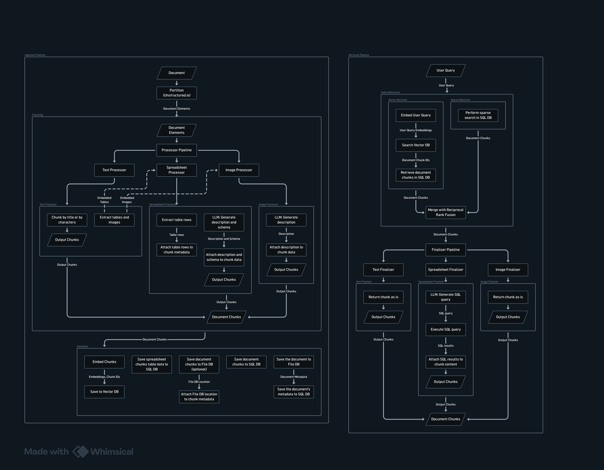

# Plugin RAG Server

A Retrieval-Augmented Generation (RAG) backend built around a **plugin architecture** for document types. It ingests text documents and spreadsheets, creates searchable representations, retrieves relevant evidence using both semantic and lexical search, and uses a text-only LLM to generate grounded answers.

The application is designed around separate ingestion, retrieval, and answer-generation stages. Document-type behavior lives in **plugins**, which the system discovers and orchestrates through a plugin registry and per-run contexts and runtimes.

## Table of Contents

- [Plugin RAG Server](#plugin-rag-server)
  - [Table of Contents](#table-of-contents)
  - [Features](#features)
    - [Plugin Architecture](#plugin-architecture)
    - [Semantic and Lexical Retrieval](#semantic-and-lexical-retrieval)
    - [Spreadsheet Semantics](#spreadsheet-semantics)
  - [Running the Application](#running-the-application)
    - [Start the Application](#start-the-application)
    - [Requirements](#requirements)
    - [Environment Configuration](#environment-configuration)
  - [Architecture](#architecture)
    - [Plugin Architecture](#plugin-architecture-1)
    - [Ingestion Pipeline](#ingestion-pipeline)
    - [Retrieval Pipeline](#retrieval-pipeline)
    - [Answer Generation](#answer-generation)
  - [Plugin Lifecycle](#plugin-lifecycle)
  - [Context and Runtime](#context-and-runtime)
  - [File Emission and Subprocess](#file-emission-and-subprocess)
    - [File descriptions](#file-descriptions)
    - [Reassembling tables split across pages](#reassembling-tables-split-across-pages)
  - [Project Structure](#project-structure)
    - [`app/plugin`](#appplugin)
    - [`app/plugins`](#appplugins)
    - [`app/api`](#appapi)
    - [`app/api_schemas`](#appapi_schemas)
    - [`app/core`](#appcore)
    - [`app/errors`](#apperrors)
    - [`app/llm`](#appllm)
    - [`app/embedders`](#appembedders)
    - [`app/retrievers`](#appretrievers)
    - [`app/models`](#appmodels)
    - [`app/services`](#appservices)
    - [`app/store_file`, `app/store_sql`, `app/store_vector`](#appstore_file-appstore_sql-appstore_vector)
    - [`app/utils`](#apputils)
    - [`app/container.py`](#appcontainerpy)
  - [Design Principles](#design-principles)
  - [Document Chunk Conventions](#document-chunk-conventions)
  - [Tests](#tests)
  - [Extending the Application](#extending-the-application)
    - [Adding Another Plugin](#adding-another-plugin)
    - [Adding Another LLM Provider](#adding-another-llm-provider)
    - [Adding Another Embedding Provider](#adding-another-embedding-provider)
    - [Adding Another Retrieval Strategy](#adding-another-retrieval-strategy)
    - [Changing Storage Technology](#changing-storage-technology)

## Features

### Plugin Architecture

Each supported document type is a **plugin** — identity plus a set of overridable lifecycle methods. The pipeline is lifecycle-driven: the services fire events, and plugins react. A plugin:

- decides which files it manages (`accepts(context)`),
- **generates chunks** by overriding `on_ingestion_process` (returning `IngestedChunk`s; it never persists them),
- **emits files** through the runtime for subprocess by other plugins,
- **finalizes its own chunks** by overriding `on_retrieval_finalize` during retrieval/answering.

All database and file persistence is owned by the services — plugins only produce data and react to events.

Built-in plugins:

- `TextPlugin` — text documents (pdf, docx, txt, md, html, ...). Chunks the text, reassembles embedded tables that were split across page breaks (merging fragments that share a schema and have no other content between them) and emits each as a CSV for the `TablePlugin`, and emits embedded images with `runtime.emit_file` while indexing each figure with a description chunk. Constructor options `ignore_images` and `ignore_tables` (both default `False`) skip the processing overhead of embedded images or embedded tables: with `ignore_images`, image extraction is disabled in the partition call entirely (no emitted figure files, no description chunks); with `ignore_tables`, no reassembled CSV is emitted, but the table text still ends up in the document chunks (`infer_table_structure` stays on for that). An ignored image still occupies its place in the document stream and keeps separating runs of tables.
- `TablePlugin` — spreadsheets (csv, xlsx, xls) and emitted table files. Generates one chunk per table with LLM-generated, retrieval-optimized descriptions (workbook context + per-table description + sample data). Its metadata carries `table_name` and, for tables embedded in a parent document, the forwarded `source_page_number`. Schema and relationship extraction is deliberately left to the agent that queries the stored tables; it does not emit or store files.

Adding a new document type means adding one plugin and registering it — no changes to the ingestion or retrieval services.

### Semantic and Lexical Retrieval

The retrieval pipeline combines two complementary strategies:

- **Dense retrieval** using vector embeddings and ChromaDB
- **Sparse retrieval** using SQL-based full-text search (FTS5)

The results are merged using **Reciprocal Rank Fusion (RRF)** to produce a combined ranking.

This allows the system to handle both semantic queries and queries that depend on exact terms, names, or values.

### Spreadsheet Semantics

Spreadsheets are read with pandas and described once with the LLM:

- Workbook meaning
- Retrieval-optimized table descriptions

Schema and relationship extraction is deliberately **not** done at ingestion: the agent that queries the stored tables identifies them.

Each table becomes one searchable chunk (description + sample data). The actual table data is **stored as a file** (CSV per table in `documents/`), not as SQL rows — the chunk row links to it via `source_id` (→ `__documents__.file_path`). Table content is expected to be queried through agentic tools in future; the stored CSV and the chunk metadata (`table_name`, and `source_page_number` for embedded tables) are the source of truth for that.

## Running the Application

### Start the Application

```bash
python -m run
```

### Requirements

The application requires:

- Python 3.11+
- FastAPI
- Unstructured.io
- SQLAlchemy
- SQLite
- ChromaDB
- LLM API access (either Gemini or OpenAI)
- A configured embedding model

Some Unstructured document formats may also require additional system dependencies.

### Environment Configuration

Create a `.env` file in the root directory containing the configuration required by the application.

At minimum, the Gemini provider requires a Google API key.

The application configuration in `app/core/config.py` is the source of truth for the available settings.

Example:

```env
GOOGLE_API_KEY=your-api-key
OPENAI_API_KEY=your-api-key
```

Additional settings may control:

- Database locations
- Vector database locations
- Storage directories
- Collection names
- Retrieval limits
- Other application options

## Architecture



The architecture is divided into two independent pipelines: **ingestion** and **retrieval**. Both pipelines meet at the document chunks stored across the application's databases, and both are driven by **plugins**.

### Plugin Architecture

The plugin system lives in `app/plugin`:

| Piece                                        | Role                                                                                                                                                                                                                                                        |
| -------------------------------------------- | ----------------------------------------------------------------------------------------------------------------------------------------------------------------------------------------------------------------------------------------------------------- |
| `Plugin` (`app/plugin/base.py`)              | The contract: `name`, `accepts`, and the overridable lifecycle methods (all no-op by default) — plugins override only what they care about.                                                                                                                 |
| `IngestionFile` (`app/plugin/context.py`)    | The unit of ingestion: a file's `filename`, `content_type`, `file_bytes`, an optional `description`, and its own auto-generated, read-only `source_id`. Used for top-level ingestion and for files a plugin emits.                                          |
| `IngestionContext` (`app/plugin/context.py`) | Read-only details of the run: `file` (the file being ingested), `parent_file` (the file that emitted it, if any), and `origin_file` (the top-most file in the emission chain — `file` itself for top-level ingestion).                                      |
| `IngestionRuntime` (`app/plugin/runtime.py`) | Per-ingestion-run state, created by the ingestion service: `context`, the shared services (`llm`, `embedder`, `vector_storage`, `sql_storage`, `file_storage`), `registry`, and `emit_file`. Chunk and source persistence stays with the ingestion service. |
| `RetrievalRuntime` (`app/plugin/runtime.py`) | Per-retrieval-run state, created by the retrieval service: `context`, `llm`.                                                                                                                                                                                |
| `PluginRegistry` (`app/plugin/registry.py`)  | Holds the registered plugins and fires each pipeline event to all of them — concurrently, in registration order. The ingestion and retrieval services fire events through it, and `accepting_plugins` offers each document to all plugins via `accepts`.    |

The plugin framework lives in `app/plugin/`; the built-in plugins live in `app/plugins/`. The container (`app/container.py`) is the composition root for the external collaborators (providers, storages, retrievers, plugins); the `RagService` facade composes the pipeline internals from them -- the plugin registry and the ingestion and retrieval services.

The **ingestion service owns all persistence** — plugins only generate chunks and emit files.

### Ingestion Pipeline

The `IngestionService` drives the pipeline through lifecycle events. It walks the emission tree **recursively** through an inner function defined inside `ingest()`: the top-level file is processed first, and each file a plugin emits is ingested by a recursive call to that same inner function (the public `ingest()` stays a thin entry point). The steps below describe one file's turn; a file's emitted children are processed before it completes.

**Persistence is collected, then committed.** While the tree is walked, the service only _collects_ what would be saved (source files, chunk records, vectors). It commits everything in one `_commit` step **only after every file in the tree has processed successfully** — so if any single process fails, nothing is saved.

1. Build the `IngestionContext` for the file (no type resolution — the system does not judge what a file is): the `IngestionFile`, its `parent_file` (the emitting file, when it was emitted), and its `origin_file` (the top-most file in the emission chain — itself for top-level ingestion). The file's optional `description` is extra context plugins may use when they need LLM inference about it.
2. Offer the file to **every registered plugin** via `plugin.accepts(context)`. Each plugin decides for itself whether it wants to manage that file (the built-ins claim their file extensions; a plugin may claim as many or as few document shapes as it likes). If no plugin accepts the top-level file, ingestion fails with `InvalidDocumentError`; an emitted file no plugin accepts is skipped with a warning.
3. Build a per-run `IngestionRuntime`. Every file that goes through ingestion — the user upload and each file a plugin emits — is stored exactly once in the File DB (`documents/`) with a `__documents__` row. The `is_origin` column marks the user upload (`True`); emitted files are stored with `is_origin = False`.
4. Run **`on_ingestion_process`** on every registered plugin (`context`, `runtime`), concurrently. Plugins that accept the file generate chunks — and may call `runtime.emit_file` along the way — and return them. Any parsing a plugin needs is done inside the method (e.g. `TextPlugin` parses with Unstructured.io itself — the service never parses). The service collects all returned chunks and persists them:
    - chunk text is embedded and stored in the **Vector DB**,
    - the chunk record is stored in the **SQL DB** (`__chunks__`), with the lineage (`source_id`, `parent_source_id`, `origin_source_id`) stored as columns,
    - chunk metadata is saved **as-is** — plugins define their own keys. Before persistence, chunks inherit the metadata of the chunks above them in the emission tree (their own keys win on a collision). A chunk never carries file bytes; a plugin that wants a file persisted emits it with `runtime.emit_file`.
5. Drain the files the plugins emitted (`runtime.pop_emitted_files()`). Each emitted file is re-ingested through the same pipeline (`ingest`) with the emitting file passed as its `parent_file` and the run's `origin_file` passed through unchanged. Every `IngestionFile` has its own auto-generated `source_id`, so the emitted file is a distinct source; `parent_file` is its direct emitter and `origin_file` is the top-most ancestor. The returned chunks are combined with the parent's.
6. Fire lifecycle events throughout (`on_ingestion_started`, `on_file_emitted`, `on_file_subprocessed`, `on_file_completed`) — every event receives the per-run `IngestionRuntime`. `on_file_completed` fires for every file the pipeline walks (children before their emitter) once its whole subtree is processed. **`on_ingestion_completed` fires exactly once, at the very end, after the commit** — the whole ingestion is done and everything is persisted.

For text documents, `TextPlugin` parses the source with Unstructured.io and chunks the text. Embedded tables are reassembled and emitted as CSVs (see [File Emission and Subprocess](#file-emission-and-subprocess)) for the `TablePlugin` to enrich; embedded images are emitted as files with `runtime.emit_file`, and the figure's description (caption + nearby text) is indexed as its own text chunk.

### Retrieval Pipeline

The retrieval pipeline starts with a **user query** and performs two retrieval strategies in parallel through the **Hybrid Retriever**.

The **Vector Retriever** embeds the query, searches the Vector DB, and receives ranked chunk IDs. Those IDs are then used to retrieve the corresponding chunk records from the SQL DB.

At the same time, the **Sparse Retriever** performs lexical search against the SQL/FTS database and produces its own ranked list of chunks.

The two ranked result sets are then combined using **Reciprocal Rank Fusion (RRF)**. RRF combines the rankings rather than the raw scores, allowing dense and sparse retrieval to contribute to a common ranking even though their scoring systems are different.

The service then builds a per-run **`RetrievalContext`** (holding `user_query`) and **`RetrievalRuntime`** (`context`, `llm`) and runs **`on_retrieval_finalize`** on every plugin for each resulting chunk (`context`, `chunk`, `runtime`). Plugins that want query-aware enrichment override this method, recognize their own chunks via `chunk.plugin`, and return an enriched replacement (or `None` to leave the chunk unchanged). Plugins that do not override it do no work.

### Answer Generation

After finalization, the **RAG Service** assembles the finalized chunks into evidence and sends the user query plus evidence to the (text-only) LLM to generate a grounded answer.

## Plugin Lifecycle

The pipeline is driven by a fixed set of lifecycle events. Each event is a method on the `Plugin` base class with a no-op default; plugins override only what they care about. The registry fires every event to **all** registered plugins — concurrently, in registration order — and each plugin decides for itself whether to act (typically by guarding with `accepts`, or by recognizing its own chunks via `chunk.plugin`). Every event receives the per-run context and the runtime of its phase — ingestion events carry `IngestionRuntime`, retrieval events carry `RetrievalRuntime`.

Two events are **response events** — the service consumes what the plugins return:

- `on_ingestion_process` — plugins return the `IngestedChunk`s they generated (or `[]`); the service flattens them in registration order.
- `on_retrieval_finalize` — plugins return a replacement `RetrievedChunk` for chunks they produced, or `None` to leave the chunk unchanged; the service applies the last non-None replacement.

All other events are observational. Event-specific arguments come first; `context` and `runtime` are always the last two.

| Event                 | Plugin method            | Arguments                                      | Returns                  |
| --------------------- | ------------------------ | ---------------------------------------------- | ------------------------ |
| `ingestion_started`   | `on_ingestion_started`   | `context`, `runtime`                           | —                        |
| `ingestion_process`   | `on_ingestion_process`   | `context`, `runtime`                           | `list[IngestedChunk]`    |
| `file_emitted`        | `on_file_emitted`        | `emitted_file`, `context`, `runtime`           | —                        |
| `file_subprocessed`   | `on_file_subprocessed`   | `emitted_file`, `chunks`, `context`, `runtime` | —                        |
| `file_completed`      | `on_file_completed`      | `chunks`, `context`, `runtime`                 | —                        |
| `ingestion_completed` | `on_ingestion_completed` | `chunks`, `context`, `runtime`                 | —                        |
| `retrieval_finalize`  | `on_retrieval_finalize`  | `chunk`, `context`, `runtime`                  | `RetrievedChunk \| None` |
| `retrieval_completed` | `on_retrieval_completed` | `chunks`, `context`, `runtime`                 | —                        |

`file_completed` fires once per file in the emission tree (the file's `context`, the chunks of its whole subtree, and that file's `runtime`) after the file and all its emitted children are processed, before anything is committed. `ingestion_completed` fires once per ingestion, at the very end, after the commit: the top-level `context`, all chunks, and the top-level `runtime`.

Example — a plugin that generates chunks and audits ingestion:

```python
class AuditPlugin(Plugin):
    @property
    def name(self) -> str:
        return "audit"

    def accepts(self, context) -> bool:
        return context.file.filename.lower().endswith(".png")

    async def on_ingestion_process(self, context, runtime) -> list[IngestedChunk]:
        if not self.accepts(context):
            return []
        return [self.make_chunk(context)]  # the service persists these

    async def on_ingestion_completed(self, chunks, context, runtime) -> None:
        print(f"[audit] {context.file.filename} -> {len(chunks)} chunks")
```

A new lifecycle point is added as a method on the `Plugin` base class (no-op default) and fired from the registry — there is no open event namespace.

## Context and Runtime

Plugin constructors take **options only — no services**. Lifecycle methods receive:

- **`IngestionContext`** — what is being ingested: `file` (an `IngestionFile` — the bytes, identity, auto-generated `source_id`, and optional `description`), `parent_file` (the emitting file, set for subprocessed files), and `origin_file` (the top-most file in the emission chain — `file` itself for top-level ingestion).
- **`RetrievalContext`** — what is being retrieved: `user_query`. It is the retrieval-phase counterpart of `IngestionContext` and is passed to every retrieval lifecycle method.
- **`IngestionRuntime`** — the per-run state and shared services a plugin gets:

| Member                                                            | Purpose                                                                    |
| ----------------------------------------------------------------- | -------------------------------------------------------------------------- |
| `context`                                                         | The ingestion context for this run.                                        |
| `llm`                                                             | The text-only LLM provider.                                                |
| `embedder`                                                        | The embedding provider.                                                    |
| `vector_storage` / `sql_storage` / `file_storage`                 | The shared storages, for plugins that need to read or write other content. |
| `registry`                                                        | The plugin registry; `emit_file` reports emitted files through it.         |
| `emit_file(filename, content_type, file_bytes, description=None)` | Emit a file for subprocess by the plugins that accept it.                  |

Chunk and source persistence is not a runtime action — the ingestion service persists everything the plugins return: it embeds and stores chunk records, stores every file exactly once in `documents/`, and stores lineage as dedicated columns: `source_id` (the file the chunk came from), `parent_source_id` (the emitting file, `None` for top-level files), and `origin_source_id` (always set — the top-most file in the emission chain; a top-level file is its own origin).

On the retrieval side, the `RetrievalService` builds a per-run **`RetrievalContext`** (holding `user_query`) and a **`RetrievalRuntime`** exposing `context` and `llm`. Both are passed to every retrieval lifecycle method.

## File Emission and Subprocess

Plugins can emit files so embedded content is processed as its own document:

1. A plugin calls `runtime.emit_file(filename, content_type, file_bytes, description=None)` while handling `on_ingestion_process`. This builds a new `IngestionFile` (with its own auto-generated `source_id`).
2. After the hook completes, the `IngestionService` takes all emitted files and runs each one back through `ingest`, passing the emitting file as the `parent_file` — full pipeline, distinct source. Each emitted file is also stored in `documents/` (with `is_origin = False`), so embedded content like extracted tables and images is persisted alongside the original upload.
3. The emitted file is offered to all plugins again, and the one(s) that accept it process it.

### File descriptions

Context about a file travels on the file itself:

- `IngestionFile` carries an optional `description` and its own auto-generated, read-only `source_id`. Every file ingested — top-level or emitted — is a distinct source identified by `source_id`; lineage between an emitted file and the file that produced it is carried by `IngestionContext.parent_file`.
- Plugins read the description via `context.file.description` and can feed it to an LLM. Chunks store their lineage as columns: `source_id` (the file they came from), `parent_source_id` (the emitting file's `source_id`, `None` for top-level files), and `origin_source_id` (always set — the top-most file in the emission chain, so any chunk can be referenced back to the original document it descended from, not just its direct parent; a top-level file is its own origin). `IngestionContext` exposes the matching `file`, `parent_file`, and `origin_file`.

This is how a plugin enriches content it hands off: `TextPlugin` emits each reassembled embedded table as a CSV whose description combines the parent file's `description` (if any) with the document text found around the table. `TablePlugin` then passes that context to its LLM. The same mechanism is used for images: `TextPlugin` emits each extracted image with a description (caption + nearby text), ready for a future `ImagePlugin` to consume.

The main use today is a text document with embedded tables: `TextPlugin` reassembles each parsed table and emits it as a CSV, and `TablePlugin` generates the searchable chunk for it. Embedded images are emitted with `runtime.emit_file`; until an image plugin accepts them the service logs that they were not accepted, but the figure's description is still indexed as a text chunk so the content stays searchable.

**Chunk metadata inheritance** covers machine-readable provenance across the emission tree: when the ingestion service walks the tree, every chunk inherits the merged metadata of all the chunks above it, and its own keys win on a collision. So an embedded table's chunk inherits `source_page_number` from its parent document's text chunks without any file-level plumbing; a top-level spreadsheet's chunks have no ancestors and keep exactly what the plugin set. Inheritance is transitive through the whole chain and applies before persistence, hooks (`file_subprocessed`, `file_completed`, `ingestion_completed`), and the API response.

### Reassembling tables split across pages

A table that spans a page break is parsed by Unstructured into separate table elements, one per page. `TextPlugin` walks the element stream in order and groups **runs** of tables: a run is a maximal sequence of table elements with only page furniture (page breaks, page numbers, headers, footers) between them. Any other element — text, an image, an unparseable table — ends the run, because that content genuinely separates the tables in the document. A bare page break does not.

Each run is handed to `merge_table_fragments` (in `app/plugins/text.py`, since the logic is specific to that plugin's parsing), which folds the fragments back into whole tables:

- a fragment whose header repeats the table's header is a continuation page — its header is dropped (kept once) and its rows appended;
- a fragment with **no** header is appended as raw data rows when its column count matches and its values are type-compatible with the table's existing rows (a column does not mix numbers with non-numeric text); this recovers continuations where the header was not repeated;
- anything else (different column count, different header, conflicting value types) starts a new table.

Each reassembled table is emitted as a CSV with a header row (generated `col_N` names when none was detected, so downstream readers treat row 0 as column names) and a description containing, up to `NEARBY_TEXT_CHARS` (default 500) characters of the document text found immediately before and after the table.

## Project Structure

### `app/plugin`

The plugin framework: the `Plugin` base class with its overridable lifecycle methods, `IngestionFile` / `IngestionContext`, `IngestionRuntime` / `RetrievalRuntime`, and the `PluginRegistry` that fires events to all plugins. `IngestionFile` is the unit of ingestion — a file's bytes, an auto-generated `source_id`, and an optional `description` — used both at the API boundary (built by the RAG service from the upload) and for files a plugin emits for subprocess. `IngestionContext` is `file` + `origin_file` + `parent_file`.

### `app/plugins`

Built-in document-type plugins. Each module contains one `Plugin` subclass.

#### `app/plugins/text.py`

`TextPlugin` — accepts text document extensions.

Constructor options: `ignore_images` and `ignore_tables` (both default `False`). When set, the plugin skips the processing overhead of embedded images or embedded tables: `ignore_images` disables image extraction in the partition call itself (`extract_images_in_pdf` and the image-block payload options turned off), so no figure files or description chunks are produced; `ignore_tables` emits no reassembled CSV, but the table text still ends up in the document chunks (`infer_table_structure` stays on so it is readable). An ignored image still occupies its place in the document stream and keeps separating runs of tables from each other.

Parses the source with Unstructured.io (the only place in the app that uses it; with `infer_table_structure=True` so table cell grids are available, and with image extraction enabled so embedded pictures carry their bytes). It chunks the text (`chunk_by_title` when titles are present, otherwise `chunk_elements`), groups the stream into runs of tables (see [Reassembling tables split across pages](#reassembling-tables-split-across-pages)), reassembles each run with `merge_table_fragments` (defined in this module, since the logic is specific to this plugin's parsing), emits each reassembled table as a CSV with a description (the parent file's `description` plus the nearby text) for the `TablePlugin`, and emits each embedded image with `runtime.emit_file` (bytes + caption/nearby-text description) while indexing the figure with a text chunk carrying that description.

#### `app/plugins/table.py`

`TablePlugin` — accepts spreadsheet extensions.

Reads CSV/XLS/XLSX with pandas (one table per sheet), keeping the schema exactly as it came from the file — table and column names are not normalized, deduplicated, or rewritten into safe identifiers — builds a row-sampled catalog, asks the LLM for one workbook-level pass that produces retrieval-optimized descriptions (the workbook and each table), and returns one chunk per table from `on_ingestion_process`. Each chunk carries searchable text (table name, workbook context, description, sample data) and `table_name` metadata plus, for tables embedded in a parent document, the `source_page_number` inherited from the parent document's chunks. Schema and relationship extraction is deliberately out of scope at ingestion — the agent that queries the stored tables identifies them. The plugin does not emit or store any file, and table rows are not loaded into SQL. When the ingested file carries a `description` (e.g. the text found around an embedded table in the parent document), it is passed to the LLM as additional context for the descriptions.

### `app/api`

Contains the FastAPI HTTP routes.

#### `app/api/rag.py`

Contains the RAG endpoints:

- `/rag/ingest`: uploads and ingests a document. The endpoint is the only place that touches FastAPI's `UploadFile`; it reads the upload and hands the plain bytes, filename, and content type to the RAG service, which builds the `IngestionFile`.
- `/rag/retrieve`: retrieves relevant chunks without generating a final answer.
- `/rag/answer`: performs retrieval and generates the final LLM answer.

### `app/api_schemas`

Contains Pydantic models used specifically at the API boundary. These are separate from the application's internal dataclasses so internal objects can contain fields that should not be exposed through JSON responses.

### `app/core`

Application-wide configuration and core infrastructure.

- `app/core/config.py` — settings (API keys, model names, storage paths, collection names).
- `app/core/exceptions.py` — exception handlers registered on the FastAPI app.

### `app/errors`

Domain-specific errors (`InvalidDocumentError` for unsupported/invalid uploads).

### `app/llm`

- `app/llm/base.py` — the `LLMProvider` interface: the wire types (`ChatMessage`, `ImageContent`, `ToolSpec`, `ToolCall`, `ChatResult`) and the public surface. A `ChatMessage`'s content is a plain string or a list of text and image parts (vision). Providers implement one raw primitive (`complete` -- the lowest-level public entry point, accepting any combination of tools and a JSON schema) and declare `capabilities` (both providers assume full native support: tool calling, structured outputs, and vision). The base class provides `answer` (plain text), `chat` (native tool calling), and `structured` (native JSON-schema output, validated with pydantic) as thin compositions of it. There are no fallback strategies: if the model or endpoint cannot comply, the error propagates.
- `app/llm/openai.py` — the OpenAI-compatible implementation (custom `base_url` supported, e.g. a routing endpoint).
- `app/llm/gemini.py` — the Gemini implementation.

### `app/embedders`

- `app/embedders/base.py` — the `Embedder` interface.
- `app/embedders/gemini.py` — the Gemini embedding implementation.

### `app/retrievers`

- `app/retrievers/base.py` — the `Retriever` interface.
- `app/retrievers/vector.py` — dense retrieval via Chroma, re-loading chunk records from SQL.
- `app/retrievers/sparse.py` — lexical retrieval via FTS5.
- `app/retrievers/hybrid.py` — runs retrievers concurrently and merges rankings with RRF.

### `app/models`

Internal application models.

- `app/models/chunk.py` — `IngestedChunk` and `RetrievedChunk`. Both carry `plugin` (the name of the plugin that produced the chunk), which is how retrieval routes chunks back to their finalizer.
- `app/models/rag.py` — `RagAnswer`.
- `app/models/vector.py` — `VectorSearchResult`.

### `app/services`

- `app/services/ingestion.py` — the pipeline driver: offers each file to all plugins, builds context/runtime, runs `on_ingestion_process` on every plugin, persists everything (source files, chunk records, vectors), and re-ingests emitted files.
- `app/services/retrieval.py` — runs the hybrid retriever and runs `on_retrieval_finalize` on every plugin for each chunk.
- `app/services/rag.py` — the top-level facade and the composition point of the pipelines. It builds the `PluginRegistry` from the `plugins` option, and the ingestion and retrieval services -- which take the registry -- from the collaborators it is given (`llm`, `embedder`, `retriever`, the storages). `initialize()` creates the system tables at startup; `ingest(file_bytes, filename, content_type, description=None)` builds the `IngestionFile` and delegates; plus `retrieve` and `answer`.

### `app/store_file`, `app/store_sql`, `app/store_vector`

Storage abstractions and local implementations:

- `FileStorage` — upload/delete/read files. Local implementation stores everything under `.storage/file/documents/`: the original user uploads (`is_origin = True` in `__documents__`) and every file a plugin emits (`is_origin = False`). Each file is stored exactly once, when it goes through ingestion — there is no separate chunk-file storage.
- `SqlStorage` — tables, upserts, read-only queries, FTS5 search. Local implementation is one SQLite database (`.storage/sqlite/spreadsheets.sqlite3/database.db`) holding the `__chunks__` and `__documents__` system tables.
- `VectorStorage` — stores chunk IDs + embeddings, cosine search. Local implementation is a persistent Chroma collection.

### `app/utils`

- `app/utils/ranking.py` — RRF ranking.
- `app/utils/string.py` — brace-safe prompt template rendering.

### `app/container.py`

The composition root for the external collaborators. It builds the providers, storages, retrievers, the built-in plugins, and the `RagService` facade (which gets the plugins through its `plugins` option), and exposes the FastAPI lifespan (`rag_service.initialize()`, storage shutdown). The pipeline internals -- the plugin registry and the ingestion/retrieval services -- are composed inside the facade.

## Design Principles

- **The pipeline is the plugin lifecycle.** Services fire a fixed set of lifecycle events through the registry; plugins react by overriding the matching methods, with data (chunks, replacement chunks) or observations. There is no per-type dispatch in the system and no open event namespace.
- **Plugins own document types.** A plugin decides which files it wants to manage (`accepts`) and overrides the ingestion/retrieval lifecycle methods for them. The system does not special-case document types and offers every file to all plugins.
- **Services own chunk and source persistence.** Plugins generate and return data; the ingestion service is the only component that embeds, stores, or commits chunks, files, and vectors (the storages are exposed on the runtime for other plugin needs).
- **Context and runtime, not globals.** Lifecycle methods receive everything they need per run: a read-only context (document details) plus a runtime (shared services — LLM, embedder, storages — and `emit_file`). Plugin constructors take options only, never services.
- **Decoupled stores and providers.** Storage and AI providers sit behind small interfaces (`FileStorage`, `SqlStorage`, `VectorStorage`, `LLMProvider`, `Embedder`).
- **Native LLM capabilities, no silent fallbacks.** Both providers assume the model natively supports tool calling, structured outputs (JSON schema), and vision. There is no degraded prompt-based path: if the model or endpoint cannot comply, the error propagates to the caller.
- **The facade composes, the container injects.** The container supplies the external collaborators (LLM, embedder, retriever, storages, plugins); `RagService` composes everything internal from them -- the plugin registry and the ingestion/retrieval services. The API layer only ever talks to the facade.
- **Text and images to the LLM, nothing else.** Messages carry text and image parts (vision); no other binary attachments anywhere in the pipeline.

## Document Chunk Conventions

- `IngestedChunk` fields: `plugin` (which plugin produced it, used for finalize routing), `text` (search + answer evidence), and `metadata` (free-form, plugin-defined). A chunk never carries file bytes — a plugin that wants a file persisted emits it with `runtime.emit_file`.
- **There are no metadata key conventions.** The ingestion service persists a chunk's `metadata` as-is. Keys are defined by the plugin that produced the chunk (e.g. `TablePlugin` uses `table_name` and, for embedded tables, `source_page_number`, intended for future agentic table querying).
- Lineage is **not** in the metadata — it is stored as chunk-table columns: `source_id`, `parent_source_id` (the emitting file, `None` for top-level documents), and `origin_source_id` (always set — the top-most file in the emission chain; a top-level file is its own origin).

## Tests

The test suite lives in `tests/` and uses pytest.

```bash
python -m pytest tests
```

The suite covers the registry's event fan-out and plugin acceptance, both built-in plugins (with fakes for LLM/embedding/storage, including `TextPlugin`'s `ignore_images` / `ignore_tables` options), the table-fragment merging in `TextPlugin`, the file-description flow through ingestion and subprocess, the retrieval finalization, the RAG service facade, and end-to-end ingestion pipelines using real local SQLite and file storage with a stubbed Unstructured partition — including lifecycle event ordering (`file_completed` per file, `ingestion_completed` once after the commit), chunk metadata inheritance, and commit-then-fail atomicity.

## Extending the Application

### Adding Another Plugin

1. Create a module in `app/plugins/` with a `Plugin` subclass. The constructor may take plugin options (tunables, thresholds) but never services — the LLM is available on `runtime.llm` in both phases.
2. Give it a unique `name` and implement `accepts(context)` — decide which files this plugin wants to manage. A plugin may accept as many document shapes as it likes; multiple plugins may accept the same file and will all run.
3. Override `on_ingestion_process` to generate `IngestedChunk`s (set `plugin=self.name` on each so retrieval can route them back; emit embedded content with `runtime.emit_file`). Do any parsing you need inside the method — the service never parses for you. Return the chunks — the service persists them.
4. Optionally override `on_retrieval_finalize` for query-aware enrichment: return a replacement chunk for chunks where `chunk.plugin == self.name`, or `None` otherwise.
5. Add it to the `plugins` option of `RagService` in `app/container.py`, alongside the built-in `TextPlugin` and `TablePlugin`.

### Adding Another LLM Provider

Implement `LLMProvider` (text-only) and provide the new implementation to the container.

### Adding Another Embedding Provider

Implement `Embedder` without changing retrieval or ingestion.

### Adding Another Retrieval Strategy

Implement `Retriever` and include it in the `HybridRetriever`. The RRF implementation combines its ranked results with the others.

### Changing Storage Technology

The storage interfaces allow the current local implementations to be replaced with other backends.

For example:

```text
LocalSqlStorage    -> PostgreSQL implementation
LocalFileStorage   -> S3 bucket
LocalVectorStorage -> Alternative vector database
```

The services and plugins remain unchanged as long as the replacement implements the corresponding interface.
